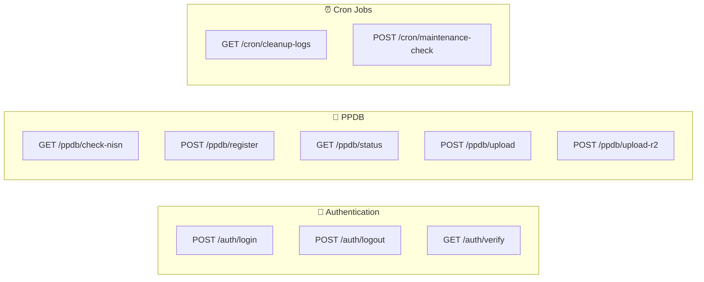
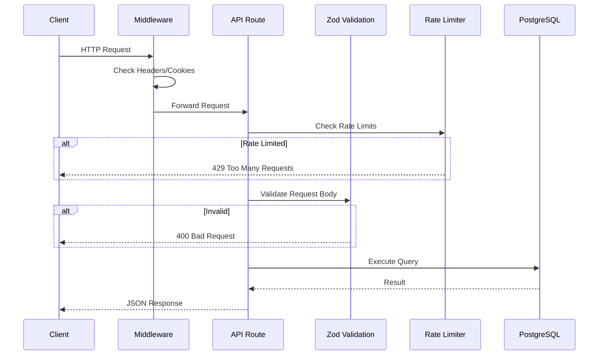
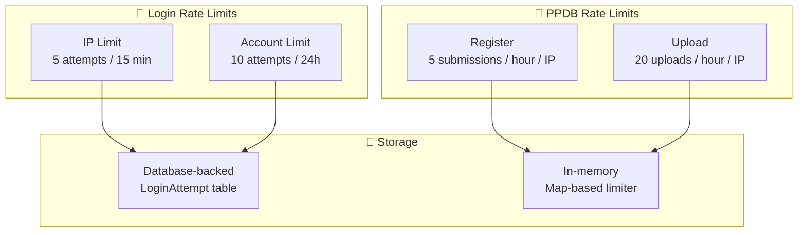

# 🔌 API Documentation

## SMP IP Yakin Jakarta - REST API Reference

**Base URL:** `https://www.smpipyakin.sch.id/api`

---

## 📑 Table of Contents

1. [Overview](#overview)
2. [API Architecture](#api-architecture)
3. [Authentication](#authentication)
4. [PPDB (Admissions)](#ppdb-admissions)
5. [Cron & Maintenance](#cron--maintenance)
6. [Error Handling](#error-handling)
7. [Rate Limiting](#rate-limiting)
8. [Security Best Practices](#security-best-practices)

---

## Overview

### API Design Philosophy

| Principle     | Implementation                    |
| ------------- | --------------------------------- |
| **RESTful**   | Standard HTTP methods (GET, POST) |
| **JSON**      | Request/response bodies in JSON   |
| **Stateless** | JWT-based authentication          |
| **Secure**    | HTTPS, rate limiting, validation  |

### Available Endpoints



---

## API Architecture



---

## Authentication

### POST `/api/auth/login`

Login to the system. Sets an HTTP-only `auth-token` cookie with IP binding and role-based permissions.

**Request Body (JSON):**

```json
{
  "username": "string",
  "password": "string",
  "role": "admin | kesiswaan | siswa | osis | ppdb_admin"
}
```

**Successful Response:**

```json
{
  "success": true,
  "message": "Login successful",
  "user": {
    "id": "uuid",
    "username": "admin",
    "name": "Administrator",
    "role": "admin",
    "email": "admin@example.com",
    "permissions": ["read", "write", "delete", "manage_users", "view_reports"]
  }
}
```

**Error Responses:**

```json
{
  "error": "Invalid credentials",
  "remainingAttempts": 3,
  "retryAfter": 0,
  "lockType": null
}
```

- Status **429** when IP rate limit is exceeded (5 attempts / 15 minutes).
- Status **423** when account lock is hit (10 attempts / 24 hours).

### POST `/api/auth/logout`

Clears the `auth-token` cookie.

**Response:**

```json
{
  "success": true,
  "message": "Logout successful"
}
```

### GET `/api/auth/verify`

Validates the current session cookie and returns fresh user info.

**Headers:** `Cookie: auth-token=<JWT_TOKEN>`

**Successful Response:**

```json
{
  "success": true,
  "user": {
    "id": "uuid",
    "username": "admin",
    "name": "Administrator",
    "role": "admin",
    "normalizedRole": "ADMIN",
    "email": "admin@example.com",
    "permissions": ["read", "write", "delete", "manage_users", "view_reports"]
  }
}
```

**401 Response:**

```json
{ "error": "No token found" }
```

---

## PPDB (Admissions)

### GET `/api/ppdb/check-nisn?nisn=1234567890`

Checks whether an applicant with the given NISN already exists and whether a retry is allowed.

**Successful Response (existing):**

```json
{
  "exists": true,
  "message": "NISN 1234567890 sudah terdaftar atas nama Ananda",
  "data": {
    "id": "uuid",
    "name": "Ananda",
    "status": "REJECTED",
    "retries": 0,
    "allowRetry": true
  }
}
```

**Successful Response (available):**

```json
{
  "exists": false,
  "message": "NISN 1234567890 tersedia untuk pendaftaran"
}
```

### POST `/api/ppdb/register`

Submits a PPDB registration (gated by `siteSettings` PPDB window). Rate limited to **5 submissions per hour per IP**.

**Request Body (JSON):**

```json
{
  "namaLengkap": "Nama Lengkap",
  "nisn": "1234567890",
  "jenisKelamin": "laki-laki | perempuan",
  "tempatLahir": "Jakarta",
  "tanggalLahir": "2010-01-01",
  "alamatLengkap": "Alamat",
  "asalSekolah": "SMP Contoh",
  "kontakOrtu": "081234567890",
  "namaOrtu": "Nama Orang Tua",
  "emailOrtu": "ortu@example.com",
  "documents": [
    {
      "cloudinaryId": "ppdb_uploads/abc",
      "url": "https://res.cloudinary.com/...",
      "fileName": "ijazah.pdf",
      "fileSize": 12345,
      "mimeType": "application/pdf",
      "documentType": "ijazah"
    }
  ]
}
```

**Successful Response:**

```json
{
  "success": true,
  "message": "Pendaftaran PPDB berhasil dikirim",
  "data": {
    "id": "uuid",
    "nisn": "1234567890",
    "name": "Nama Lengkap",
    "status": "PENDING",
    "createdAt": "2025-01-01T00:00:00.000Z"
  }
}
```

**Notes & Conflict Handling:**

- Duplicate **PENDING**/**ACCEPTED** applications return **409**.
- **REJECTED** applications may re-register **once** (increments `retries`); further attempts return **409**.
- Document URLs are mapped into `ijazahUrl`, `aktaKelahiranUrl`, `kartuKeluargaUrl`, and `pasFotoUrl` in the database.

### GET `/api/ppdb/status?nisn=1234567890`

Returns the application status for a given NISN.

**Successful Response:**

```json
{
  "success": true,
  "data": {
    "nisn": "1234567890",
    "name": "Nama Lengkap",
    "status": "pending | accepted | rejected",
    "statusMessage": "Pendaftaran Anda sedang dalam tahap verifikasi dokumen. Estimasi waktu: 2-3 hari kerja.",
    "feedback": "Optional feedback",
    "submittedAt": "2025-01-01T00:00:00.000Z",
    "documentsCount": 3,
    "documents": [{ "type": "ijazah", "url": "https://..." }]
  }
}
```

### POST `/api/ppdb/upload`

Uploads a document to **Cloudinary** using the PPDB preset.

**Content-Type:** `multipart/form-data`

**Form Fields:**

| Field          | Required | Description                                                 |
| -------------- | -------- | ----------------------------------------------------------- |
| `file`         | Yes      | JPG / PNG / PDF, max 5MB                                    |
| `documentType` | Yes      | `ijazah` \| `aktaKelahiran` \| `kartuKeluarga` \| `pasFoto` |
| `nisn`         | Yes      | Applicant NISN (used for folder naming)                     |

**Successful Response:**

```json
{
  "success": true,
  "data": {
    "cloudinaryId": "ppdb_uploads/abc",
    "url": "https://res.cloudinary.com/...",
    "fileName": "ijazah.pdf",
    "fileSize": 12345,
    "mimeType": "application/pdf",
    "documentType": "ijazah"
  }
}
```

### POST `/api/ppdb/upload-r2`

Uploads a document to **Cloudflare R2** (S3-compatible). Rate limited to **20 uploads per hour per IP**.

**Content-Type:** `multipart/form-data` (same fields and validation as `/upload`).

**Successful Response:**

```json
{
  "success": true,
  "data": {
    "cloudinaryId": "1234567890/ijazah_1730000000000.pdf",
    "url": "https://pub-xxxx.r2.dev/1234567890/ijazah_1730000000000.pdf",
    "fileName": "ijazah.pdf",
    "fileSize": 12345,
    "mimeType": "application/pdf",
    "documentType": "ijazah"
  }
}
```

---

## Cron & Maintenance

### GET `/api/cron/cleanup-logs`

Deletes login attempt records older than 30 days.

**Security:** Protected by `CRON_SECRET`

**Headers:**

```
Authorization: Bearer <CRON_SECRET>
```

**Response:**

```json
{
  "success": true,
  "deletedCount": 42
}
```

### POST `/api/cron/maintenance-check`

Activates/deactivates maintenance mode based on active `maintenanceSchedules`.

**Headers:**

```
Authorization: Bearer <CRON_SECRET>
```

**Response (maintenance active):**

```json
{
  "success": true,
  "active": true,
  "scheduleId": "uuid"
}
```

**Response (maintenance inactive):**

```json
{
  "success": true,
  "active": false
}
```

---

## Error Handling

### Standard Error Format

```json
{
  "error": "Human readable error message",
  "success": false
}
```

### HTTP Status Codes

| Code  | Meaning           | When Used                  |
| ----- | ----------------- | -------------------------- |
| `200` | Success           | Successful operation       |
| `400` | Bad Request       | Validation failed          |
| `401` | Unauthorized      | Missing/invalid token      |
| `403` | Forbidden         | Insufficient permissions   |
| `404` | Not Found         | Resource not found         |
| `409` | Conflict          | Duplicate NISN, etc.       |
| `423` | Locked            | Account temporarily locked |
| `429` | Too Many Requests | Rate limit exceeded        |
| `500` | Server Error      | Internal error             |

### Authentication Error Response

```json
{
  "error": "Invalid credentials",
  "remainingAttempts": 3,
  "retryAfter": 0,
  "lockType": null
}
```

### Rate Limit Error Response

```json
{
  "error": "Too many login attempts. Try again in 15 minutes.",
  "remainingAttempts": 0,
  "retryAfter": 900,
  "lockType": "ip"
}
```

---

## Rate Limiting

### Rate Limit Summary



### Login Rate Limiting

| Scope       | Limit       | Window     | Storage    | Action          |
| ----------- | ----------- | ---------- | ---------- | --------------- |
| Per IP      | 5 attempts  | 15 minutes | PostgreSQL | Temporary block |
| Per Account | 10 attempts | 24 hours   | PostgreSQL | Account lock    |

### PPDB Rate Limiting

| Endpoint          | Limit         | Window | Storage   |
| ----------------- | ------------- | ------ | --------- |
| `/ppdb/register`  | 5 submissions | 1 hour | In-memory |
| `/ppdb/upload-r2` | 20 uploads    | 1 hour | In-memory |

### File Upload Limits

| Constraint    | Value                                |
| ------------- | ------------------------------------ |
| Max file size | 5MB                                  |
| Allowed types | JPG, PNG, PDF                        |
| Naming        | `{nisn}/{docType}_{timestamp}.{ext}` |

---

## Security Best Practices

### 🔐 Authentication

| Practice             | Implementation                       |
| -------------------- | ------------------------------------ |
| **Token Storage**    | HTTP-Only cookies (`auth-token`)     |
| **Token Binding**    | IP address in JWT payload            |
| **Cookie Settings**  | SameSite=Strict, Secure (production) |
| **Session Duration** | 24 hours                             |

### 🛡️ Request Validation

| Layer            | Tool         | Purpose         |
| ---------------- | ------------ | --------------- |
| **Schema**       | Zod 4.x      | Type validation |
| **Sanitization** | Built-in     | XSS prevention  |
| **CAPTCHA**      | Math CAPTCHA | Bot prevention  |
| **Honeypot**     | Hidden field | Bot detection   |

### 🔒 Transport Security

| Requirement | Value                   |
| ----------- | ----------------------- |
| Protocol    | HTTPS only (production) |
| HSTS        | Enabled via headers     |
| CSP         | Content Security Policy |

### 📊 Audit Logging

| Event             | Logged Data                               |
| ----------------- | ----------------------------------------- |
| Login attempt     | IP, username, user-agent, success/failure |
| PPDB registration | IP, NISN, timestamp                       |
| Cron jobs         | Execution time, records affected          |

---

## 📚 Related Documentation

| Document                                  | Description                     |
| ----------------------------------------- | ------------------------------- |
| [ARCHITECTURE.md](./docs/ARCHITECTURE.md) | System architecture             |
| [SECURITY.md](./docs/SECURITY.md)         | Security implementation details |
| [TESTING.md](./docs/TESTING.md)           | API testing guide               |

---

### 📝 Changelog

| Date              | Changes                                                                                      |
| ----------------- | -------------------------------------------------------------------------------------------- |
| **January 2026**  | Updated to align with Next.js 15.5.9, added visual diagrams, enhanced security documentation |
| **December 2025** | Initial API documentation                                                                    |

---

_Last Updated: January 2026_
