# SMP IP Yakin Website - Development Guidelines

This document provides guidelines and instructions for internal development and contribution to the SMP IP Yakin Website project.
Access to this repository is restricted to authorized personnel and development team members.

## 📋 Table of Contents

- [Code of Conduct](#code-of-conduct)
- [Getting Started](#getting-started)
- [Development Workflow](#development-workflow)
- [Coding Standards](#coding-standards)
- [Commit Guidelines](#commit-guidelines)
- [Pull Request Process](#pull-request-process)
- [Project Structure](#project-structure)

---

## 🎯 Contribution Workflow Overview

```mermaid
flowchart LR
    subgraph Setup["🚀 Setup"]
        Clone[Clone Repo]
        Install[npm ci]
        Env[Setup .env]
        DB[Setup Database]
    end

    subgraph Develop["💻 Development"]
        Branch[Create Branch]
        Code[Write Code]
        Test[Run Tests]
        Lint[Run Linter]
    end

    subgraph Submit["📤 Submit"]
        Push[Push Changes]
        PR[Open PR]
        Review[Code Review]
        Merge[Merge to Main]
    end

    Clone --> Install --> Env --> DB
    DB --> Branch --> Code --> Test --> Lint
    Lint --> Push --> PR --> Review --> Merge

    style Clone fill:#e1f5fe
    style Merge fill:#c8e6c9
```



---

## 📜 Professional Conduct

This project follows a professional code of conduct applicable to all staff and developers. Please be respectful and constructive in all interactions.

---

## 🚀 Getting Started

### Prerequisites

| Requirement | Version | Purpose             |
| ----------- | ------- | ------------------- |
| Node.js     | 20+     | Runtime environment |
| PostgreSQL  | 14+     | Database            |
| Git         | Latest  | Version control     |
| npm         | Latest  | Package manager     |

### Setup Flow


### Setup Development Environment

```bash
# Clone the repository (Authorized Access Required)
git clone https://github.com/your-repo/website-school-smpipyakin.git
cd website-school-smpipyakin

# Install dependencies
npm ci

# Setup environment
cp .env.example .env
# Configure your .env file

# Setup database
npm run db:generate
npm run db:migrate
npm run db:seed

# Start development server
npm run dev
```

---

## 🔄 Development Workflow

### Git Branching Strategy


### Branch Naming Convention

| Type        | Pattern                | Example                      | Purpose               |
| ----------- | ---------------------- | ---------------------------- | --------------------- |
| 🆕 Feature  | `feature/description`  | `feature/add-student-report` | New functionality     |
| 🐛 Bug Fix  | `fix/description`      | `fix/login-rate-limit`       | Bug resolution        |
| 🔥 Hotfix   | `hotfix/description`   | `hotfix/security-patch`      | Urgent production fix |
| ♻️ Refactor | `refactor/description` | `refactor/auth-module`       | Code improvement      |
| 📚 Docs     | `docs/description`     | `docs/update-readme`         | Documentation         |

### Workflow Steps


1. **Create a branch** from `main`
2. **Make changes** with meaningful commits
3. **Test thoroughly** before pushing
4. **Open a Pull Request** with a clear description
5. **Address review feedback**
6. **Merge** after approval

---

## 📝 Coding Standards

### Code Quality Architecture

```mermaid
flowchart TB
    subgraph Standards["📋 Coding Standards"]
        TS[TypeScript Guidelines]
        React[React/Next.js Guidelines]
        Style[Style Guidelines]
    end

    subgraph Tools["🛠 Enforcement Tools"]
        ESLint[ESLint]
        Prettier[Prettier]
        TSC[TypeScript Compiler]
    end

    subgraph Quality["✅ Quality Checks"]
        Lint[npm run lint]
        Build[npm run build]
        Test[npm run test]
    end

    Standards --> Tools --> Quality
```



### TypeScript Guidelines

| Rule        | ✅ Good Practice          | ❌ Avoid           |
| ----------- | ------------------------- | ------------------ |
| Types       | Use explicit interfaces   | `any` type         |
| Constants   | Use `const` for immutable | Magic numbers      |
| Async       | Use `async/await`         | Unhandled promises |
| Null checks | Use optional chaining     | Unchecked nulls    |

```typescript
// ✅ Good: Use explicit types
interface User {
  id: string;
  username: string;
  role: UserRole;
}

// ✅ Good: Use const for immutable values
const MAX_LOGIN_ATTEMPTS = 5;

// ✅ Good: Use async/await for async operations
async function fetchUser(id: string): Promise<User | null> {
  try {
    return await prisma.user.findUnique({ where: { id } });
  } catch (error) {
    console.error('Error fetching user:', error);
    return null;
  }
}

// ❌ Bad: Avoid any type
function processData(data: any) { ... }

// ❌ Bad: Avoid magic numbers
if (attempts > 5) { ... }
```

### React/Next.js Guidelines


```tsx
// ✅ Good: Use functional components with proper typing
interface ButtonProps {
  label: string;
  onClick: () => void;
  variant?: "primary" | "secondary";
}

export function Button({ label, onClick, variant = "primary" }: ButtonProps) {
  return (
    <button onClick={onClick} className={`btn btn-${variant}`}>
      {label}
    </button>
  );
}

// ✅ Good: Use Server Components by default
// Only use 'use client' when necessary

// ✅ Good: Use Server Actions for mutations
("use server");
export async function createPost(data: FormData) {
  // Server-side logic
}
```

### File Naming Conventions

| Type             | Convention | Example           | Location          |
| ---------------- | ---------- | ----------------- | ----------------- |
| Components       | PascalCase | `UserProfile.tsx` | `src/components/` |
| Utilities        | camelCase  | `dateFormat.ts`   | `src/utils/`      |
| Server Actions   | camelCase  | `users.ts`        | `src/actions/`    |
| Types/Interfaces | PascalCase | `types.ts`        | `src/types/`      |
| Hooks            | camelCase  | `useAuth.ts`      | `src/hooks/`      |

### Directory Structure


```
src/
├── actions/          # Server Actions (grouped by domain)
├── app/              # Next.js App Router
├── components/       # React Components (grouped by feature)
├── hooks/            # Custom React Hooks
├── lib/              # External library configurations
├── shared/           # Shared types and data
└── utils/            # Utility functions
```

---

## 💬 Commit Guidelines

We follow [Conventional Commits](https://www.conventionalcommits.org/) specification.

### Commit Message Flow


### Commit Message Format

```
<type>(<scope>): <description>

[optional body]

[optional footer]
```

### Types

| Type       | Emoji | Description   | Example                           |
| ---------- | ----- | ------------- | --------------------------------- |
| `feat`     | ✨    | New feature   | `feat(auth): add remember me`     |
| `fix`      | 🐛    | Bug fix       | `fix(ppdb): resolve upload error` |
| `docs`     | 📚    | Documentation | `docs: update API docs`           |
| `style`    | 💅    | Code style    | `style: format with prettier`     |
| `refactor` | ♻️    | Refactoring   | `refactor(auth): simplify logic`  |
| `perf`     | ⚡    | Performance   | `perf: optimize queries`          |
| `test`     | 🧪    | Testing       | `test: add auth tests`            |
| `chore`    | 🔧    | Maintenance   | `chore: update deps`              |
| `security` | 🔒    | Security      | `security: fix XSS vulnerability` |

### Examples

```bash
# Feature
git commit -m "feat(auth): add remember me functionality"

# Bug fix
git commit -m "fix(ppdb): resolve file upload validation error"

# Documentation
git commit -m "docs: update API documentation"

# Security
git commit -m "security(auth): implement IP-based rate limiting"
```

---

## 🔀 Pull Request Process

### PR Workflow

```mermaid
flowchart TB
    subgraph Before["📋 Before PR"]
        Standards[Follow coding standards]
        Tests[All tests pass]
        Lint[No lint errors]
        Build[Build succeeds]
        Docs[Update docs if needed]
    end

    subgraph Create["📝 Create PR"]
        Title[Clear title]
        Desc[Description]
        Type[Type of change]
        Testing[Testing info]
    end

    subgraph Review["👀 Review Process"]
        Approval[1+ Approval required]
        CI[CI checks pass]
        Comments[No unresolved comments]
        UpToDate[Branch up to date]
    end

    subgraph Merge["✅ Merge"]
        Squash[Squash and merge]
        Delete[Delete branch]
    end

    Before --> Create --> Review --> Merge
```



### Before Opening a PR

| Check          | Command             | Required      |
| -------------- | ------------------- | ------------- |
| Lint passes    | `npm run lint`      | ✅            |
| Build succeeds | `npm run build`     | ✅            |
| Tests pass     | `npm run test`      | ✅            |
| Types check    | `npm run typecheck` | ✅            |
| Docs updated   | Manual              | If applicable |

### PR Template

```markdown
## Description

Brief description of the changes.

## Type of Change

- [ ] Bug fix
- [ ] New feature
- [ ] Breaking change
- [ ] Documentation update

## Testing

How has this been tested?

## Checklist

- [ ] My code follows the project's style guidelines
- [ ] I have performed a self-review
- [ ] I have commented my code where necessary
- [ ] I have updated the documentation
- [ ] My changes generate no new warnings
```

### Review Process

```mermaid
sequenceDiagram
    participant Author as PR Author
    participant CI as CI/CD
    participant Reviewer as Reviewer
    participant Main as Main Branch

    Author->>CI: Open PR
    CI->>CI: Run tests
    CI->>CI: Run linter
    CI->>CI: Build check
    CI-->>Author: ✅ All checks pass
    Reviewer->>Author: Review code
    Reviewer->>Author: Request changes
    Author->>CI: Push fixes
    Reviewer->>Author: ✅ Approve
    Author->>Main: Merge PR
```



1. At least one approval required
2. All CI checks must pass
3. No unresolved comments
4. Branch is up to date with `main`

---

## 🏗 Project Structure

### Architecture Overview

```mermaid
flowchart TB
    subgraph Frontend["🎨 Frontend"]
        Pages[Pages & Routes]
        Components[Components]
        Hooks[Custom Hooks]
    end

    subgraph Backend["⚙️ Backend"]
        Actions[Server Actions]
        API[API Routes]
        Middleware[Middleware]
    end

    subgraph Data["💾 Data Layer"]
        Prisma[Prisma ORM]
        DB[(PostgreSQL)]
    end

    subgraph External["☁️ External"]
        Cloud[Cloudinary]
        R2[Cloudflare R2]
        Email[EmailJS]
    end

    Frontend --> Backend --> Data
    Backend --> External
```



### Key Directories

| Directory         | Purpose          | Key Files                       |
| ----------------- | ---------------- | ------------------------------- |
| `prisma/`         | Database schema  | `schema.prisma`, `seed.ts`      |
| `public/`         | Static assets    | `manifest.json`, icons          |
| `src/actions/`    | Server Actions   | `auth.ts`, `news.ts`, `ppdb.ts` |
| `src/app/`        | Next.js routes   | Page components, layouts        |
| `src/components/` | React components | UI components by feature        |
| `src/hooks/`      | Custom hooks     | `useAuth.ts`, `useToast.ts`     |
| `src/lib/`        | Configurations   | `prisma.ts`, `auth.ts`          |
| `src/utils/`      | Utilities        | `security.ts`, `format.ts`      |
| `docs/`           | Documentation    | Architecture, diagrams          |
| `tests/`          | E2E Tests        | Playwright specs                |

### Important Files

| File                | Purpose          | Description              |
| ------------------- | ---------------- | ------------------------ |
| `middleware.ts`     | Route protection | Auth & role-based access |
| `lib/auth.ts`       | Authentication   | JWT & session management |
| `lib/prisma.ts`     | Database         | Prisma client singleton  |
| `utils/security.ts` | Security         | XSS, rate limiting utils |

---

## 🧪 Testing Guidelines

```mermaid
flowchart LR
    subgraph Local["💻 Local Testing"]
        Unit[Unit Tests]
        E2E[E2E Tests]
        Lint[Lint Check]
    end

    subgraph CI["🔄 CI Testing"]
        CITests[Automated Tests]
        Coverage[Coverage Report]
    end

    Local --> CI
```



### Test Commands

| Command             | Purpose               |
| ------------------- | --------------------- |
| `npm run test`      | Run all E2E tests     |
| `npm run test:ui`   | Open Playwright UI    |
| `npm run lint`      | Run ESLint            |
| `npm run typecheck` | TypeScript validation |

---

## 📚 Related Documentation

| Document                                | Description         |
| --------------------------------------- | ------------------- |
| [ARCHITECTURE.md](docs/ARCHITECTURE.md) | System architecture |
| [TECH_STACK.md](docs/TECH_STACK.md)     | Technology stack    |
| [TESTING.md](docs/TESTING.md)           | Testing guide       |
| [SECURITY.md](docs/SECURITY.md)         | Security practices  |
| [DEPLOYMENT.md](docs/DEPLOYMENT.md)     | Deployment guide    |

---

## ❓ Questions?

If you have questions about development procedures, please contact the Lead Developer or open an internal issue with the `question` label.

---

**SMP IP YAKIN Internal Development Team**

_Last Updated: January 2026_
