# 🫠SMP IP Yakin - School Management System [](https://github.com/blackjac7/website-school-smpipyakin/actions/workflows/ci.yml)

<div align="center">


**Sistem Manajemen Sekolah Modern, Aman, dan Komprehensif**

[🚀 Getting Started](#-getting-started) •
[📚 Documentation](#-documentation) •
[✨ Features](#-features) •
[🔐 Security](#-security) •
[🧪 Testing](#-testing)

</div>

---

## 📖 Overview

**SMP IP Yakin Website** adalah platform manajemen sekolah lengkap yang dirancang untuk menyederhanakan tugas administratif, meningkatkan komunikasi, dan memberikan pengalaman digital yang seamless untuk siswa, guru, dan administrator.

Dibangun dengan teknologi web modern dan best practice industri, sistem ini memprioritaskan **keamanan (security)**, **performa (performance)**, dan **pengalaman pengguna (user experience)**.

### 🎯 Key Highlights

| Aspect                  | Description                                        |
| ----------------------- | -------------------------------------------------- |
| **5 Role Dashboards**   | Admin, Kesiswaan, OSIS, Siswa, PPDB Admin          |
| **25+ Database Models** | Comprehensive data structure with Prisma ORM       |
| **Enterprise Security** | JWT + IP Binding, Rate Limiting, CAPTCHA           |
| **Modern Stack**        | Next.js 15 App Router, TypeScript, Tailwind CSS v4 |
| **Cloud Integration**   | Cloudinary, Cloudflare R2, EmailJS, Flowise AI     |
| **PWA Ready**           | Installable, offline-capable Progressive Web App   |

### 📊 System Architecture Overview

```mermaid
graph TB
    subgraph Client["🌐 Client Layer"]
        Browser[Browser/PWA]
    end

    subgraph Frontend["⚡ Frontend - Vercel"]
        NextJS[Next.js 15 App Router]
        RSC[React Server Components]
        SA[Server Actions]
    end

    subgraph Backend["🔧 Backend Services"]
        API[API Routes]
        Auth[JWT Authentication]
        RBAC[Role-Based Access]
    end

    subgraph Data["💾 Data Layer"]
        Prisma[Prisma ORM]
        PG[(PostgreSQL 15+)]
    end

    subgraph External["☁️ External Services"]
        Cloudinary[Cloudinary CDN]
        R2[Cloudflare R2]
        EmailJS[EmailJS]
        Flowise[Flowise AI]
    end

    Browser --> NextJS
    NextJS --> RSC
    NextJS --> SA
    RSC --> Prisma
    SA --> Prisma
    API --> Auth
    Auth --> RBAC
    Prisma --> PG
    SA --> Cloudinary
    SA --> R2
    Browser --> EmailJS
    Browser --> Flowise
```



---

## ✨ Features

### 🎯 Core Modules

| Module                           | Description                                                      | Roles              |
| -------------------------------- | ---------------------------------------------------------------- | ------------------ |
| **Multi-Role Dashboard**         | Dedicated dashboards dengan fitur spesifik per role              | All                |
| **PPDB System**                  | Workflow pendaftaran digital lengkap dengan document management  | PPDB Admin, Public |
| **Content Management**           | News, announcements, hero sliders, stats, dan event management   | Admin, OSIS        |
| **Academic Calendar**            | Jadwal sekolah dan perencanaan event                             | Admin, Kesiswaan   |
| **Student Works & Achievements** | Showcase dan review submission siswa, termasuk toggle akses OSIS | Siswa, Kesiswaan   |
| **Facility Management**          | Fasilitas sekolah, ekstrakurikuler, dan profil guru              | Admin              |
| **Religious Programs**           | Log menstruasi, jadwal adzan, dan tugas pembersihan karpet       | OSIS, Kesiswaan    |
| **Maintenance & Settings**       | Toggle maintenance mode, feature flags, dan pengaturan situs     | Admin              |

### 🔄 User Flow Diagram

```mermaid
flowchart LR
    subgraph Public["🌐 Public Access"]
        Home[Homepage]
        News[Berita]
        PPDB[Pendaftaran PPDB]
        Facilities[Fasilitas]
        Contact[Kontak]
    end

    subgraph Auth["🔐 Authentication"]
        Login[Login Page]
        RateLimit[Rate Limiting]
        CAPTCHA[Math CAPTCHA]
    end

    subgraph Dashboards["📊 Role Dashboards"]
        DAdmin[Dashboard Admin]
        DKesiswaan[Dashboard Kesiswaan]
        DOSIS[Dashboard OSIS]
        DSiswa[Dashboard Siswa]
        DPPDB[Dashboard PPDB]
    end

    Home --> Login
    PPDB --> Login
    Login --> RateLimit
    RateLimit --> CAPTCHA
    CAPTCHA -->|Admin| DAdmin
    CAPTCHA -->|Kesiswaan| DKesiswaan
    CAPTCHA -->|OSIS| DOSIS
    CAPTCHA -->|Siswa| DSiswa
    CAPTCHA -->|PPDB Admin| DPPDB
```



### 🔐 Security Features

| Feature                       | Implementation                                              | Protection          |
| ----------------------------- | ----------------------------------------------------------- | ------------------- |
| **Login Rate Limiting**       | Database-backed: 5 attempts/15m per IP, 10/24h per username | Brute Force         |
| **JWT + HTTP-Only Cookies**   | IP Binding dalam payload, SameSite Strict                   | Session Hijacking   |
| **Maintenance Bypass**        | Cookie-driven dengan admin exemption                        | Controlled Access   |
| **Input Sanitization & CSP**  | Zod validation + React auto-escaping                        | XSS                 |
| **CAPTCHA & Honeypot**        | Math CAPTCHA + hidden honeypot fields                       | Bot Attacks         |
| **Role-Based Access Control** | 5 roles dengan permission granular + OSIS access flag       | Unauthorized Access |
| **Server Action Auth**        | Defense-in-depth dengan per-action role verification        | Function-level Auth |

### 🚀 Performance Features

| Feature                 | Technology                       | Benefit                         |
| ----------------------- | -------------------------------- | ------------------------------- |
| **Progressive Web App** | next-pwa                         | Installable & offline-capable   |
| **Image Optimization**  | Cloudinary CDN + next-cloudinary | Fast loading, auto-optimization |
| **Responsive Design**   | Tailwind CSS v4                  | Mobile-first architecture       |
| **SEO Optimized**       | next-sitemap + robots.ts         | Search engine visibility        |
| **Server Components**   | React 18 RSC                     | Reduced bundle size             |

---

## 🛠 Tech Stack

### 📊 Technology Overview Diagram

```mermaid
graph TB
    subgraph Core["🎯 Core Framework"]
        Next[Next.js 15.5.9]
        React[React 18.3.1]
        TS[TypeScript 5.9.3]
    end

    subgraph Styling["🎨 UI/UX"]
        Tailwind[Tailwind CSS v4.1]
        Framer[Framer Motion 12.x]
        Lucide[Lucide React]
        Heroicons[Heroicons 2.2]
    end

    subgraph Data["💾 Data & State"]
        Prisma[Prisma 6.19]
        Postgres[(PostgreSQL 15+)]
        Zod[Zod 4.x]
    end

    subgraph Security["🔒 Security"]
        Jose[Jose JWT]
        Bcrypt[bcryptjs]
        RateLimit[DB Rate Limiter]
    end

    subgraph Cloud["☁️ Cloud Services"]
        Cloudinary[Cloudinary]
        R2[Cloudflare R2]
        EmailJS[EmailJS]
        Flowise[Flowise AI]
    end

    Next --> React
    Next --> TS
    Next --> Tailwind
    Next --> Prisma
    Prisma --> Postgres
    Next --> Jose
    Jose --> Bcrypt
    Next --> Cloudinary
    Next --> R2
```



### Core Technologies

| Category       | Technology                                    | Version | Purpose                                      |
| -------------- | --------------------------------------------- | ------- | -------------------------------------------- |
| **Framework**  | [Next.js](https://nextjs.org/)                | 15.5.9  | Full-stack React framework dengan App Router |
| **Language**   | [TypeScript](https://www.typescriptlang.org/) | 5.9.3   | Type-safe development                        |
| **Runtime**    | [Node.js](https://nodejs.org/)                | 20.x    | Server runtime environment                   |
| **Styling**    | [Tailwind CSS](https://tailwindcss.com/)      | v4.1.11 | Utility-first CSS framework                  |
| **Database**   | [PostgreSQL](https://www.postgresql.org/)     | 15+     | Relational database                          |
| **ORM**        | [Prisma](https://www.prisma.io/)              | 6.19    | Type-safe database client                    |
| **Validation** | [Zod](https://zod.dev/)                       | 4.x     | Runtime schema validation                    |

### Authentication & Security Stack

| Category          | Technology                                         | Implementation                    |
| ----------------- | -------------------------------------------------- | --------------------------------- |
| **JWT Library**   | [Jose](https://github.com/panva/jose)              | Token signing & verification      |
| **Password Hash** | [bcryptjs](https://www.npmjs.com/package/bcryptjs) | 12 salt rounds                    |
| **Session**       | HTTP-Only Cookies                                  | auth-token dengan IP binding      |
| **Rate Limiting** | Database-backed                                    | LoginAttempt model + cron cleanup |

### Cloud & External Services

| Service           | Provider                                               | Usage                                     |
| ----------------- | ------------------------------------------------------ | ----------------------------------------- |
| **Image Storage** | [Cloudinary](https://cloudinary.com/)                  | News, profiles, hero images + PPDB preset |
| **File Storage**  | [Cloudflare R2](https://developers.cloudflare.com/r2/) | PPDB documents (S3-compatible)            |
| **Email**         | [EmailJS](https://www.emailjs.com/)                    | Contact form delivery                     |
| **AI Chatbot**    | [Flowise](https://flowiseai.com/)                      | Embedded assistant                        |
| **Hosting**       | [Vercel](https://vercel.com/)                          | Edge deployment                           |

### UI/UX Libraries

| Category       | Library                      | Purpose                              |
| -------------- | ---------------------------- | ------------------------------------ |
| **Animations** | Framer Motion 12.x           | Page transitions, micro-interactions |
| **Lottie**     | @lottiefiles/dotlottie-react | Loading animations                   |
| **Icons**      | Lucide React + Heroicons     | Icon system                          |
| **Charts**     | Recharts 3.6                 | Dashboard visualizations             |
| **Theme**      | next-themes                  | Dark/light mode                      |
| **Toast**      | react-hot-toast              | Notifications                        |
| **Date**       | date-fns + date-fns-tz       | Date formatting                      |

---

## 🚀 Getting Started

### Prerequisites

- **Node.js** 20.x or higher (matches CI pipeline)
- **PostgreSQL** 14+ (local instance or managed service like Neon/Aiven)
- **npm** (use `npm ci` for reproducible installs)
- **Git** for version control

### Installation

```bash
# 1. Clone the repository
git clone https://github.com/your-repo/website-school-smpipyakin.git
cd website-school-smpipyakin

# 2. Install dependencies
npm ci

# 3. Setup environment variables
cp .env.example .env
# Edit .env with your credentials

# 4. Setup database
npm run db:generate    # Generate Prisma Client
npm run db:migrate     # Run migrations against Postgres
npm run db:seed        # Seed base users/content

# 5. Start development server
npm run dev
```

Open [http://localhost:3000](http://localhost:3000) in your browser.

### Environment Variables

Create a `.env` file from [.env.example](./.env.example) and fill in the values. The table below shows where each secret should live during development and deployment.

| Variable                                                                                                                                       | Purpose                                             | Where to set                                                                                                   | How to obtain                                                     |
| ---------------------------------------------------------------------------------------------------------------------------------------------- | --------------------------------------------------- | -------------------------------------------------------------------------------------------------------------- | ----------------------------------------------------------------- |
| `DATABASE_URL`, `DIRECT_URL`                                                                                                                   | PostgreSQL connection for Prisma (app + migrations) | **Local .env**, **Vercel** (Preview & Production), **GitHub Actions** (only if running migrations/tests in CI) | From your Postgres provider (VPS or managed DB connection string) |
| `JWT_SECRET`                                                                                                                                   | Signing key for login sessions                      | **Vercel**, local .env, optional GitHub for build checks                                                       | Generate with `openssl rand -base64 32`                           |
| `CRON_SECRET`                                                                                                                                  | Protects scheduled API routes                       | **Vercel**, local .env                                                                                         | Generate with `openssl rand -hex 16`                              |
| `NEXT_PUBLIC_APP_URL`                                                                                                                          | Canonical URL for SEO & links                       | **Vercel** (Preview/Prod) and local .env                                                                       | Use your site domain or `http://localhost:3000` locally           |
| `NEXT_PUBLIC_CLOUDINARY_CLOUD_NAME`, `CLOUDINARY_API_KEY`, `CLOUDINARY_API_SECRET`                                                             | Cloudinary uploads for news/facilities/gallery      | **Vercel**, local .env                                                                                         | Cloudinary Dashboard → Settings → API Keys                        |
| `NEXT_PUBLIC_CLOUDINARY_CLOUD_NAME_PPDB`, `CLOUDINARY_API_KEY_PPDB`, `CLOUDINARY_API_SECRET_PPDB`, `NEXT_PUBLIC_CLOUDINARY_UPLOAD_PRESET_PPDB` | Dedicated preset for PPDB & admin uploads           | **Vercel**, local .env                                                                                         | Cloudinary Dashboard → Upload presets                             |
| `R2_ACCOUNT_ID`, `R2_ACCESS_KEY_ID`, `R2_SECRET_ACCESS_KEY`, `R2_BUCKET_NAME`, `R2_PUBLIC_URL`                                                 | Cloudflare R2 for documents                         | **Vercel**, local .env                                                                                         | Cloudflare R2 → Create API token & bucket                         |
| `NEXT_PUBLIC_EMAILJS_SERVICE_ID`, `NEXT_PUBLIC_EMAILJS_TEMPLATE_ID`, `NEXT_PUBLIC_EMAILJS_PUBLIC_KEY`                                          | Contact form delivery (EmailJS)                     | **Vercel**, local .env                                                                                         | EmailJS Dashboard → Account → API Keys                            |
| `NEXT_PUBLIC_FLOWISE_API_URL`, `NEXT_PUBLIC_FLOWISE_CHATFLOW_ID`                                                                               | Flowise chatbot embed                               | **Vercel**, local .env                                                                                         | Flowise deployment → Chatflow details                             |
| `NEXT_PUBLIC_VERCEL_SPEED_INSIGHTS`                                                                                                            | Enable Vercel analytics widgets                     | **Vercel**, local .env                                                                                         | Set to `1` to enable                                              |
| `MAX_FILE_SIZE`                                                                                                                                | Upload limit (bytes) for file endpoints             | **Vercel**, local .env                                                                                         | Keep default `5242880` or adjust as needed                        |

> GitHub Actions only needs `VERCEL_TOKEN`, `VERCEL_ORG_ID`, and `VERCEL_PROJECT_ID` to trigger deployments; runtime application secrets stay in **Vercel Project Settings**. See [Deployment](#-deployment) for a CI/CD diagram and step-by-step setup.

---

## 📜 Available Scripts

| Command                     | Description                                     |
| --------------------------- | ----------------------------------------------- |
| `npm run dev`               | Start development server                        |
| `npm run build`             | Build for production                            |
| `npm run postbuild`         | Generate sitemap after build                    |
| `npm run start`             | Start production server                         |
| `npm run lint`              | Run ESLint (flat config)                        |
| `npm run db:generate`       | Generate Prisma Client                          |
| `npm run db:migrate`        | Apply migrations locally (`prisma migrate dev`) |
| `npm run db:migrate-static` | Migrate static JSON content into the database   |
| `npm run db:seed`           | Seed database with base users and settings      |
| `npm run db:seed-content`   | Seed content (news, announcements, gallery)     |
| `npm run db:seed-all`       | Run both base and content seeders               |
| `npm run db:reset`          | Reset database (⚠️ destructive)                 |
| `npm run test`              | Run full Playwright suite (headless)            |
| `npm run test:critical`     | Run critical-path Playwright spec used in CI    |
| `npm run test:ui`           | Open Playwright UI mode                         |
| `npm run test:report`       | Open the latest Playwright HTML report          |

---

## 👥 Default Accounts

> ⚠️ **Warning**: Change all default passwords before deploying to production!

| Role       | Username    | Password   | Dashboard Access       |
| ---------- | ----------- | ---------- | ---------------------- |
| Admin      | `admin`     | `admin123` | `/dashboard-admin`     |
| Kesiswaan  | `kesiswaan` | `admin123` | `/dashboard-kesiswaan` |
| Student    | `siswa001`  | `admin123` | `/dashboard-siswa`     |
| OSIS       | `osis001`   | `admin123` | `/dashboard-osis`      |
| PPDB Staff | `ppdb001`   | `admin123` | `/dashboard-ppdb`      |

---

## 📚 Documentation

| Document                                                     | Description                                    |
| ------------------------------------------------------------ | ---------------------------------------------- |
| [API_DOCUMENTATION.md](./API_DOCUMENTATION.md)               | REST API endpoints (auth, PPDB uploads/status) |
| [docs/DOCS.md](./docs/DOCS.md)                               | Technical deep dive (architecture, flows, API) |
| [docs/ARCHITECTURE.md](./docs/ARCHITECTURE.md)               | High-level system architecture & diagrams      |
| [docs/PROJECT_STRUCTURE.md](./docs/PROJECT_STRUCTURE.md)     | Directory layout & module ownership            |
| [docs/TECH_STACK.md](./docs/TECH_STACK.md)                   | Frameworks, libraries, and services used       |
| [docs/DEPLOYMENT.md](./docs/DEPLOYMENT.md)                   | CI/CD, environments, and secret management     |
| [docs/TESTING.md](./docs/TESTING.md)                         | Playwright setup, commands, and fixtures       |
| [docs/TEST_STRATEGY.md](./docs/TEST_STRATEGY.md)             | Scope for critical-path suite and extensions   |
| [docs/SECURITY.md](./docs/SECURITY.md)                       | Security controls and recommendations          |
| [docs/VISUAL_ARCHITECTURE.md](./docs/VISUAL_ARCHITECTURE.md) | Visual diagrams & role matrix                  |

---

## 📁 Project Structure

```
├── .github/                # GitHub Actions (CI/CD on main/develop)
│   └── workflows/
│       └── ci.yml          # Quality → tests (Postgres) → build → deploy
├── docs/                   # Project documentation & diagrams
│   ├── ARCHITECTURE.md     # System architecture & ERD
│   ├── DEPLOYMENT.md       # CI/CD & environment setup
│   ├── SECURITY.md         # Security implementations
│   ├── TESTING.md          # E2E testing guide
│   └── diagrams/           # Mermaid, PlantUML, DOT diagrams
├── prisma/                 # Database schema, migrations, and seeders
│   ├── schema.prisma       # 25+ models with full relationship mapping
│   ├── seed.ts             # Base users & settings seeder
│   ├── seedContent.ts      # Content seeder (news, announcements, etc.)
│   └── migrations/         # Database migration history
├── public/                 # Static assets (PWA icons, manifest, images)
├── scripts/                # Data utilities (e.g., migrate static JSON)
├── src/
│   ├── actions/            # Server Actions organized by domain
│   │   ├── admin/          # User, teacher, facility management
│   │   ├── osis/           # OSIS activities & news
│   │   ├── ppdb/           # PPDB dashboard & notifications
│   │   ├── student/        # Profile, works, achievements
│   │   ├── public/         # Public page data fetching
│   │   └── worship.ts      # Religious program management
│   ├── app/                # Next.js App Router
│   │   ├── (public)/       # 10+ public pages (home, news, PPDB, etc.)
│   │   ├── (dashboard)/    # 5 role-based dashboard areas
│   │   ├── api/            # REST endpoints (auth, PPDB, cron)
│   │   └── maintenance/, not-found.tsx, unauthorized/
│   ├── components/         # 16 feature-focused component directories
│   ├── hooks/              # 5 custom React hooks (useAuth, useAntiBot, etc.)
│   ├── lib/                # Core utilities (auth, JWT, Prisma, storage, rate limiting)
│   ├── shared/             # Shared data & typings
│   ├── types/              # Type-only helpers
│   └── utils/              # Helper functions
├── tests/                  # Playwright E2E testing (11 tests)
│   ├── _global-hooks.ts    # Network stubbing for deterministic tests
│   ├── critical-path.spec.ts  # 6 critical tests (public, CRUD, RBAC)
│   ├── dashboards.spec.ts  # 5 dashboard smoke tests
│   ├── fixtures/           # Test fixtures & helpers
│   └── pages/              # Page Object Models (Login, Dashboard, Public)
└── lighthouserc.json       # Lighthouse CI config
```

---

## 🔐 Security

This application implements multiple layers of security:

### Authentication & Authorization

- JWT tokens with HTTP-Only cookies (`auth-token`) and SameSite Strict in production
- IP binding inside JWT payloads to prevent session hijacking
- Secure password hashing (bcrypt, 12 salt rounds) for all seeded/auth users
- Role-based access control for **ADMIN**, **KESISWAAN**, **OSIS**, **SISWA**, and **PPDB_ADMIN**
- Login attempts logged and reset after successful authentication

### Attack Prevention

- **Brute Force**: Database-backed login limiter (5 attempts/15m per IP, 10/24h per username) with audit trails
- **PPDB Abuse Protection**: In-memory limiter for registration (5/hour/IP) and uploads (20/hour/IP) plus file-type/size guards
- **SQL Injection**: Prisma ORM with prepared statements
- **XSS**: React auto-escaping, explicit sanitization, and production CSP headers
- **CSRF**: SameSite cookies + origin validation
- **Bot Attacks**: Math CAPTCHA + honeypot fields on forms

For detailed security documentation, see [docs/SECURITY.md](./docs/SECURITY.md).

---

## 🧪 Testing

End-to-end tests use **Playwright 1.57** with Page Object Model pattern. The test suite is streamlined to **11 focused tests** that run in ~2 minutes.

### Test Structure

| Spec File               | Tests | Coverage                                                          |
| ----------------------- | ----- | ----------------------------------------------------------------- |
| `critical-path.spec.ts` | 6     | Public pages, admin news CRUD with DB verification, RBAC security |
| `dashboards.spec.ts`    | 5     | Smoke tests for all 5 role dashboards                             |

External assets and analytics are stubbed in `tests/_global-hooks.ts` to keep tests deterministic.

### Running Tests Locally

```bash
# Critical path only (matches CI) — recommended
npm run test:critical

# Full suite (headless)
npm run test

# Inspect and debug
npm run test:ui         # Interactive mode
npm run test:report     # Open the latest HTML report
```

For detailed testing documentation, see [docs/TESTING.md](./docs/TESTING.md) and [docs/TEST_STRATEGY.md](./docs/TEST_STRATEGY.md).

---

## 📊 Monitoring & Analytics

- **Vercel Analytics** - Web analytics and user insights
- **Vercel Speed Insights** - Core Web Vitals tracking
- **Lighthouse CI** - Performance auditing in CI/CD

---

## 🚀 Deployment

### Recommended Stack

| Service                                 | Purpose                         |
| --------------------------------------- | ------------------------------- |
| **Vercel**                              | Hosting (optimized for Next.js) |
| **Managed Postgres (e.g., Neon) / VPS** | PostgreSQL 15+                  |
| **Cloudflare**                          | DNS, SSL, and DDoS protection   |
| **Cloudinary**                          | Image storage and optimization  |

### Quick Deploy

[](https://vercel.com/new)

See [DEPLOYMENT.md](./docs/DEPLOYMENT.md) for detailed instructions including:

- Which secrets stay in **GitHub Actions** (`VERCEL_TOKEN`, `VERCEL_ORG_ID`, `VERCEL_PROJECT_ID`) versus **Vercel Project** variables (database, JWT, Cloudinary, R2, Flowise, EmailJS).
- How the `.github/workflows/ci.yml` pipeline promotes builds from quality checks → tests → build → staged/production deploys.
- Step-by-step guidance for retrieving credentials from each provider.

---

## 🤝 Contributing

Contributions are welcome! Please read our [Contributing Guidelines](./CONTRIBUTING.md) before submitting a pull request.

---

## 📄 License

This project is proprietary software developed for SMP IP Yakin.

---

<div align="center">

**Built with ❤️ for SMP IP Yakin**

</div>
