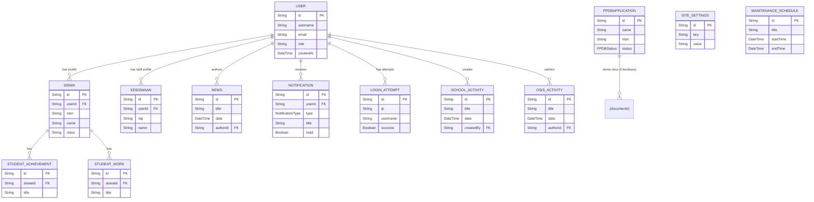

# Technical Architecture

## Overview

This project is a modern school management system built with Next.js 15, utilizing the App Router architecture. It features a hybrid rendering model (Server Components + Client Components) and a role-based access control (RBAC) system.

## Core Architecture

### 1. Framework & Routing

- **Next.js 15 (App Router):** The application uses the directory-based routing system in `src/app`.
  - `(public)`: Publicly accessible pages (Homepage, News, Login).
  - `(dashboard)`: Protected routes requiring authentication.
  - `api`: Legacy REST endpoints (transitioning to Server Actions).

### 2. Data Fetching & State

- **Server Actions:** The primary method for data mutation and fetching in Client Components. Located in `src/actions/`.
- **Server Components:** Used for initial data fetching where possible (e.g., Dashboard Layouts, Public Pages).
- **Hybrid Approach:** Client Components (`useClient`) are used for interactive elements (Forms, Modals) while fetching data via props or Server Actions.

### 3. Authentication & Security

- **Custom Auth System:** Implemented via `src/actions/auth.ts` using `jose` for JWT handling and `bcryptjs` for password hashing.
- **RBAC:** 5 distinct roles:
  - `ADMIN`: Full system access.
  - `KESISWAAN`: Student affairs management.
  - `SISWA`: Student portal access.
  - `OSIS`: Student council management.
  - `PPDB_ADMIN`: Admission system management.
- **Security Measures:**
  - HttpOnly Cookies for JWT storage.
  - Zod validation for all inputs.
  - Honeypot fields & Math Captcha for forms.
  - Rate limiting on login endpoints.

### 4. Database

- **Prisma ORM:** Type-safe database client.
- **Hybrid Database Support:**
  - **Development:** SQLite (`dev.db`).
  - **Production:** PostgreSQL (VPS/Aiven).
  - Configured via `DATABASE_URL` and `DIRECT_URL`.

## Key Modules

### Public Portal

- **CMS:** News, Announcements, and Gallery managed by Admin/OSIS.
- **PPDB (Admissions):** Public registration flow with status tracking.

### Dashboards

- **Student:** View grades, achievements, and submit works.
- **Admin:** Management of users, content, and school data.
- **Kesiswaan:** Validation of student submissions.

## Legacy Components

_Note: The project is in a transitional state regarding some architectural patterns._

- **`src/app/api/auth`**: Legacy REST endpoints still used by `AuthProvider.tsx` for session persistence.
- **`src/app/api/ppdb`**: Used by the PPDB public client for specific operations (file uploads, checks).
- **`src/lib/data`**: Contains fallback static data and type definitions shared across the app.

## File Storage

- **Cloudinary:** Used for general image hosting (News, Profiles).
- **Cloudflare R2:** Used for private/secure document storage (PPDB requirements).

---

### ERD (Entity-Relationship Diagram) ✅

A compact ERD is included for use in your thesis proposal (clean, focused view of the main domain entities and relations). Editable source files are added to `docs/diagrams/` in three formats: **Mermaid** (`erd.mmd`), **PlantUML** (`erd.puml`), and **Graphviz DOT** (`erd.dot`). Use the instructions in `docs/diagrams/README.md` to export PNG/SVG for inclusion in documents.

You can embed the Mermaid directly below (renders where Mermaid is supported):



Below are two additional diagrams useful for the thesis proposal and developer documentation.

### Runtime Flow (recommended for design & diagrams in the proposal) 🔁

This diagram shows the typical runtime interactions between the user's browser, the Next.js app (Server / Client components, Server Actions), and external services (Postgres via Prisma, Cloudinary, Cloudflare R2). See `docs/diagrams/runtime_flow.mmd` (Mermaid), `runtime_flow.puml` (PlantUML), and `runtime_flow.dot` (Graphviz) for editable sources and export instructions.

```mermaid
%% Runtime flow embedded
flowchart LR
  Browser[Browser (User)] --> EdgeLayer[Vercel / CDN]
  EdgeLayer --> App[Next.js App]
  App -->|Prisma| Postgres[(Postgres DB)]
  App --> Cloudinary[Cloudinary]
  App --> R2[Cloudflare R2]
```

### Deployment & Infrastructure (recommended for ops / security section) 🏗️

This diagram highlights how the app is deployed (Vercel), where secrets live (Vercel environment variables), and the external services that must be configured and secured (DB, Cloudinary, R2). Use `docs/diagrams/infra.mmd`, `infra.puml`, or `infra.dot` for editable sources.

```mermaid
%% Infra embedded (compact)
flowchart LR
  GitHub[GitHub (push)] --> Vercel[Vercel Platform]
  Vercel --> App[Next.js App]
  App --> Postgres[(Postgres DB)]
  App --> Cloudinary[Cloudinary]
  App --> R2[Cloudflare R2]
```

For full editable sources and export instructions, see `docs/diagrams/README.md`.

### Sequence Diagrams (Auth & PPDB) 🔁

Sequence diagrams for the **Login/Auth** flow and the **PPDB** upload-and-register flow are included in `docs/diagrams/` in Mermaid/PlantUML/DOT formats. Use these in your proposal to show step-by-step interactions (recommended for the methodology/implementation chapters).
