# 🏗️ Technical Architecture

## 📑 Table of Contents

1. [Overview](#overview)
2. [System Architecture Diagram](#system-architecture-diagram)
3. [Core Architecture](#core-architecture)
4. [Data Flow Architecture](#data-flow-architecture)
5. [Database Architecture](#database-architecture)
6. [Security Architecture](#security-architecture)
7. [Key Modules](#key-modules)
8. [External Services Integration](#external-services-integration)
9. [Deployment Architecture](#deployment-architecture)

---

## Overview

SMP IP Yakin adalah sistem manajemen sekolah modern yang dibangun dengan **Next.js 15 App Router**, menggunakan arsitektur hybrid rendering (Server Components + Client Components) dan sistem Role-Based Access Control (RBAC) untuk 5 role berbeda.

### 🎯 Design Principles

| Principle                  | Implementation                           |
| -------------------------- | ---------------------------------------- |
| **Server-First Rendering** | React Server Components sebagai default  |
| **Type Safety**            | TypeScript strict mode + Zod validation  |
| **Security by Design**     | JWT + IP binding, rate limiting, CAPTCHA |
| **Single Source of Truth** | PostgreSQL dengan Prisma ORM             |
| **Modular Architecture**   | Feature-based directory structure        |

---

## System Architecture Diagram

### High-Level Architecture

### Component Interaction Flow

---

## Core Architecture

### 1. Framework & Routing

```mermaid
graph LR
    subgraph AppRouter["📁 src/app/"]
        Public["(public)/<br/>10+ Public Pages"]
        Dashboard["(dashboard)/<br/>5 Role Dashboards"]
        API["api/<br/>REST Endpoints"]
        Special["maintenance/<br/>not-found/<br/>unauthorized/"]
    end

    subgraph Routes["Route Types"]
        Static[Static Routes]
        Dynamic[Dynamic Routes]
        Catch[Catch-all Routes]
    end

    Public --> Static
    Dashboard --> Dynamic
    API --> Dynamic
```

**Route Groups:**

| Group         | Path                        | Description                | Auth Required |
| ------------- | --------------------------- | -------------------------- | ------------- |
| `(public)`    | `/`, `/news`, `/ppdb`, etc. | Public pages               | ❌            |
| `(dashboard)` | `/dashboard-*`              | Protected dashboard routes | ✅            |
| `api`         | `/api/*`                    | REST endpoints             | Varies        |

**Public Pages (10+):**

- Homepage, News (list + detail), Announcements
- PPDB (registration, status check, info)
- Karya Siswa, Facilities, Extracurricular
- Academic Calendar, Contact, Profile
- Login page

**Protected Dashboards (5):**

- `/dashboard-admin` - Full system administration
- `/dashboard-kesiswaan` - Student affairs management
- `/dashboard-siswa` - Student portal
- `/dashboard-osis` - Student council management
- `/dashboard-ppdb` - Admissions management

### 2. Data Fetching & State Architecture

| Pattern               | Use Case                           | Location                  |
| --------------------- | ---------------------------------- | ------------------------- |
| **Server Components** | Initial data fetch, static content | Page components, layouts  |
| **Server Actions**    | Data mutations (CRUD)              | `src/actions/**/*.ts`     |
| **Client Components** | Interactive UI, forms, charts      | `"use client"` components |
| **revalidatePath**    | Cache invalidation after mutations | Inside Server Actions     |

### 3. Authentication & Security Architecture

**RBAC (Role-Based Access Control):**

> **Note:** Siswa dengan `osisAccess=true` di database dapat mengakses dashboard dan fitur OSIS melalui login dengan role OSIS. Ini memungkinkan anggota OSIS yang merupakan siswa aktif untuk mengelola program kerja dan berita OSIS.

**Security Measures:**

| Layer               | Implementation                    | Purpose                      |
| ------------------- | --------------------------------- | ---------------------------- |
| **Cookies**         | HttpOnly, SameSite=Strict, Secure | XSS & CSRF protection        |
| **JWT Payload**     | IP binding                        | Session hijacking prevention |
| **Rate Limiting**   | 5/15min IP, 10/24h account        | Brute force protection       |
| **Password**        | bcrypt 12 rounds                  | Password security            |
| **Validation**      | Zod schemas                       | Input sanitization           |
| **CAPTCHA**         | Math CAPTCHA + Honeypot           | Bot protection               |
| **Server Actions**  | Per-action role verification      | Defense-in-depth             |

### 4. Database Architecture

**25+ Database Models:**

| Category           | Models                                                                                          |
| ------------------ | ----------------------------------------------------------------------------------------------- |
| **Auth & Users**   | User, Siswa, Kesiswaan                                                                          |
| **PPDB**           | PPDBApplication                                                                                 |
| **Content**        | News, Announcement, HeroSlide, SchoolStat                                                       |
| **Activities**     | SchoolActivity, OsisActivity                                                                    |
| **Student Output** | StudentAchievement, StudentWork                                                                 |
| **Facilities**     | Facility, Extracurricular, Teacher                                                              |
| **Notifications**  | Notification                                                                                    |
| **Security**       | LoginAttempt                                                                                    |
| **Religious**      | WorshipMenstruationRecord, WorshipAdzanSchedule, WorshipCarpetSchedule, WorshipCarpetAssignment |
| **Settings**       | SiteSettings, MaintenanceSchedule                                                               |

**14 Enums:**
UserRole, GenderType, PPDBStatus, StatusApproval, PriorityLevel, WorkType, BeritaKategori, SemesterType, NotificationType, TeacherCategory, PrayerTime, TaskStatus, CarpetZone, SettingType

---

## Key Modules

### 📱 Public Portal

| Module                 | Data Source                          | Features                                    |
| ---------------------- | ------------------------------------ | ------------------------------------------- |
| **Homepage**           | Hero slides, stats, featured content | Dynamic CMS content                         |
| **News/Announcements** | Server Actions                       | Category filtering, pagination              |
| **PPDB**               | API Routes + Server Actions          | Registration, status check, document upload |
| **Karya Siswa**        | Server Actions                       | Approved student works gallery              |
| **Contact**            | EmailJS (client-side)                | Math CAPTCHA, honeypot                      |

### 👥 Dashboard Modules

### 🔗 External Services Integration

| Service           | SDK/Integration                 | Use Cases                                                                  |
| ----------------- | ------------------------------- | -------------------------------------------------------------------------- |
| **Cloudinary**    | `next-cloudinary`, `cloudinary` | News images, hero slides, profile photos, PPDB uploads                     |
| **Cloudflare R2** | `@aws-sdk/client-s3`            | PPDB documents (ijazah, akta, KK, pas foto)                                |
| **EmailJS**       | `@emailjs/browser`              | Contact form email delivery                                                |
| **Flowise**       | `flowise-embed-react`           | AI chatbot assistant (RAG-based, lihat [CHATBOT_RAG.md](./CHATBOT_RAG.md)) |

---

## Deployment Architecture

### Environment Configuration

| Environment | Database                   | SSL Mode            | Branch     |
| ----------- | -------------------------- | ------------------- | ---------- |
| Development | Local PostgreSQL           | Optional (`prefer`) | feature/\* |
| Staging     | Managed Cloud (Neon/Aiven) | `require`           | develop    |
| Production  | VPS PostgreSQL             | `prefer`            | main       |

---

## 📊 Legacy/Interop Endpoints

API Routes yang masih digunakan untuk kompatibilitas:

| Endpoint                      | Method | Purpose                          |
| ----------------------------- | ------ | -------------------------------- |
| `/api/auth/login`             | POST   | Login authentication             |
| `/api/auth/logout`            | POST   | Session termination              |
| `/api/auth/verify`            | GET    | Session validation               |
| `/api/ppdb/check-nisn`        | GET    | NISN availability check          |
| `/api/ppdb/register`          | POST   | PPDB registration                |
| `/api/ppdb/status`            | GET    | Application status               |
| `/api/ppdb/upload`            | POST   | Cloudinary upload                |
| `/api/ppdb/upload-r2`         | POST   | R2 document upload               |
| `/api/cron/cleanup-logs`      | GET    | Login log cleanup (30 days)      |
| `/api/cron/maintenance-check` | POST   | Maintenance schedule enforcement |

---

## 📈 Performance Best Practices

| Practice                      | Implementation                          |
| ----------------------------- | --------------------------------------- |
| **Server Components Default** | Mengurangi bundle size client           |
| **Streaming SSR**             | Progressive page loading                |
| **Image Optimization**        | Cloudinary transformations + next/image |
| **Code Splitting**            | Dynamic imports untuk heavy components  |
| **Cache Strategy**            | revalidatePath untuk data freshness     |
| **PWA**                       | next-pwa untuk offline capability       |

---

## 📚 Related Documentation

| Document                                       | Description                     |
| ---------------------------------------------- | ------------------------------- |
| [PROJECT_STRUCTURE.md](./PROJECT_STRUCTURE.md) | Detailed directory structure    |
| [TECH_STACK.md](./TECH_STACK.md)               | Complete technology list        |
| [SECURITY.md](./SECURITY.md)                   | Security implementation details |
| [DEPLOYMENT.md](./DEPLOYMENT.md)               | CI/CD and deployment guide      |
| [TESTING.md](./TESTING.md)                     | Testing strategy and setup      |
| [diagrams/README.md](./diagrams/README.md)     | All system diagrams             |

---

_Last Updated: January 2026_
