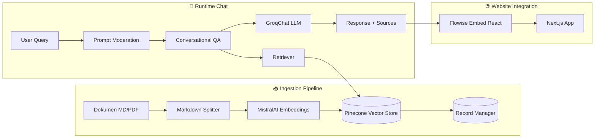
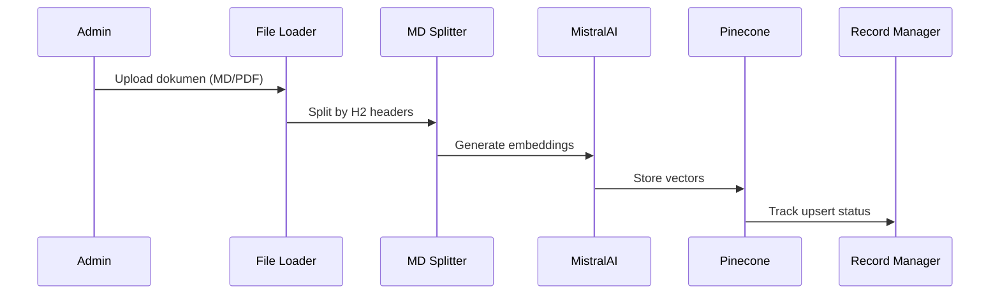
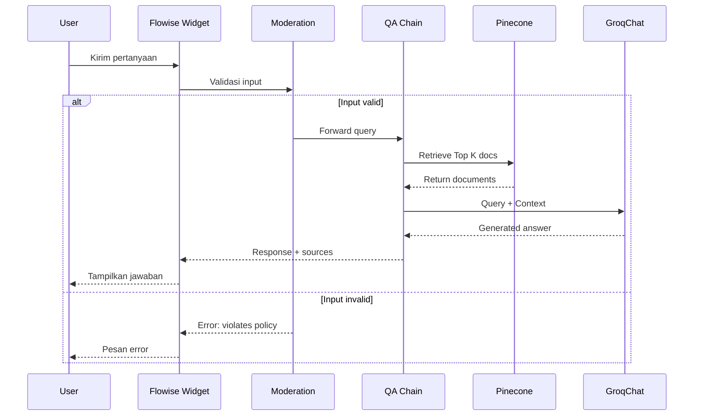

# 🤖 Dokumentasi AI Chatbot RAG (Flowise)

## 📑 Table of Contents

1. [Ringkasan Sistem](#ringkasan-sistem)
2. [Arsitektur RAG](#arsitektur-rag)
3. [Komponen Flowise](#komponen-flowise)
4. [Konfigurasi Vector Store & Embeddings](#konfigurasi-vector-store--embeddings)
5. [Proses Ingestion Dokumen](#proses-ingestion-dokumen)
6. [Integrasi dengan Website](#integrasi-dengan-website)
7. [Environment Variables](#environment-variables)
8. [Alur Kerja End-to-End](#alur-kerja-end-to-end)
9. [Troubleshooting](#troubleshooting)

---

## Ringkasan Sistem

Chatbot AI SMP IP Yakin menggunakan pendekatan **RAG (Retrieval-Augmented Generation)**: model LLM tidak hanya menjawab berdasarkan pengetahuan umum, tetapi **mengambil konteks relevan dari dokumen sekolah** (FAQ, pengumuman, dll.) yang telah disimpan pada **Vector Store**.

### Komponen Utama



---

## Arsitektur RAG

### Flow Overview (Flowise Canvas)

| Node                            | Fungsi                                                |
| ------------------------------- | ----------------------------------------------------- |
| **InMemory Cache**              | Menyimpan hasil respons untuk query yang sama         |
| **LLM Provider**                | GroqChat (compound-beta) / ChatCerebras (llama3.1-8b) |
| **Document Store**              | Penghubung ke Pinecone Retriever                      |
| **Buffer Memory**               | Menyimpan chat history untuk context-aware            |
| **Prompt Moderation**           | Validasi input (deny list)                            |
| **Conversational Retrieval QA** | Inti RAG: retrieval + jawaban                         |

---

## Komponen Flowise

### 1. InMemory Cache

- Mengurangi latency dan biaya token
- Query masuk → cek cache → jika ada, langsung return
- Cocok untuk FAQ berulang

### 2. LLM Provider

**GroqChat:**

- Model: `compound-beta`
- Temperature: `0.0` (deterministik)
- Streaming: aktif

**ChatCerebras (backup):**

- Model: `llama3.1-8b`
- Temperature: `0.0`

### 3. Buffer Memory

- Menyimpan chat history
- Memungkinkan pertanyaan lanjutan tetap nyambung

### 4. Simple Prompt Moderation

**Deny List:**

```
jailbreak, hack, password, porn, kekerasan, bullying,
"abaikan instruksi", "ignore previous"
```

Perilaku: Input melanggar → proses dihentikan → error message

### 5. Conversational Retrieval QA Chain

**Alur:**

1. User mengirim pertanyaan
2. Ambil chat history (Memory)
3. Query ke Pinecone Retriever
4. Ambil Top K dokumen
5. LLM menjawab berdasarkan konteks
6. Return jawaban + sumber (jika aktif)

---

## Konfigurasi Vector Store & Embeddings

### Embeddings: MistralAI

| Parameter       | Value           |
| --------------- | --------------- |
| Credential      | `mistralAPI`    |
| Model           | `mistral-embed` |
| Batch Size      | `512`           |
| Strip New Lines | ON              |

### Vector Store: Pinecone

| Parameter     | Value                   |
| ------------- | ----------------------- |
| Credential    | `pineconeAPI`           |
| Index         | `flowise`               |
| Namespace     | `smp-ip-yakin-document` |
| Top K         | `4`                     |
| Search Type   | `Similarity`            |
| Fetch K (MMR) | `20`                    |
| Lambda (MMR)  | `0.5`                   |

### Record Manager: Postgres (Supabase)

| Parameter     | Value                                  |
| ------------- | -------------------------------------- |
| Credential    | `supabase-database-session-pooler`     |
| Host          | `aws-1-ap-south-1.pooler.supabase.com` |
| Database      | `postgres`                             |
| Port          | `5432`                                 |
| Table Name    | `upsertion_records`                    |
| Cleanup       | `Full`                                 |
| SourcedId Key | `source`                               |

---

## Proses Ingestion Dokumen

### File Loader Settings

- **Loader Name:** `pengumuman`
- **File Type:** Markdown (`.md`)
- **PDF Usage:** One document per page

### Markdown Text Splitter

| Parameter        | Value             |
| ---------------- | ----------------- |
| Chunk Size       | `1500`            |
| Chunk Overlap    | `200`             |
| Split by Headers | `## Headers (H2)` |

### Contoh Struktur Dokumen Ideal

```markdown
# FAQ & Pengumuman

## FAQ Umum

### Bisakah mengubah jurusan?

...

## Pengumuman Penting

### Libur Sekolah 2024/2025

...
```

---

## Integrasi dengan Website

### Komponen React

**File:** `src/components/script/Chatbot.tsx`

```tsx
import { BubbleChat } from "flowise-embed-react";

<BubbleChat
  chatflowid={process.env.NEXT_PUBLIC_FLOWISE_CHATFLOW_ID}
  apiHost={process.env.NEXT_PUBLIC_FLOWISE_API_URL}
  theme={{...}}
/>
```

### Feature Flag

**File:** `src/lib/siteSettings.ts`

```typescript
"feature.chatbot": {
  value: "true",
  type: "BOOLEAN",
  category: "features",
  description: "Enable/disable AI chatbot",
}
```

### CSP Headers

**File:** `src/middleware.ts`

```
script-src: https://flowise.zeabur.app
connect-src: https://flowise.zeabur.app
frame-src: https://flowise.zeabur.app
```

---

## Environment Variables

```env
# Flowise Configuration
NEXT_PUBLIC_FLOWISE_CHATFLOW_ID=79c764d6-ef03-4796-9885-cbdef2c0d903
NEXT_PUBLIC_FLOWISE_API_URL=https://flowise.zeabur.app
```

---

## Alur Kerja End-to-End

### Ingestion Flow (Offline/Setup)



### Chat Flow (Online/Runtime)



---

## Troubleshooting

### Q: Chatbot tidak muncul?

1. Cek `feature.chatbot` di settings = `true`
2. Cek environment variables sudah di-set
3. Cek console untuk CSP errors

### Q: Jawaban tidak relevan?

1. Naikkan `Top K` (misal 6-8)
2. Cek dokumen sudah di-ingest ke namespace yang benar
3. Pastikan chunk size tidak terlalu kecil

### Q: Duplikasi jawaban?

1. Gunakan MMR search instead of Similarity
2. Pastikan Record Manager cleanup aktif

### Q: Response lambat?

1. Aktifkan InMemory Cache
2. Turunkan chunk size untuk retrieval lebih cepat
3. Pertimbangkan LLM dengan latency lebih rendah

---

## Checklist Deployment

### Credentials (di Flowise)

- [ ] `mistralAPI` - MistralAI embeddings
- [ ] `pineconeAPI` - Vector store
- [ ] `supabase-database-session-pooler` - Record manager
- [ ] `groqAPI` / `cerebrasAPI` - LLM provider

### Indexing

- [ ] File Loader preview chunk sukses
- [ ] Embeddings berjalan normal
- [ ] Vector masuk ke Pinecone namespace `smp-ip-yakin-document`
- [ ] Record Manager menyimpan upsert records

### Runtime

- [ ] Retriever mengambil dokumen
- [ ] QA Chain menghasilkan jawaban
- [ ] Memory berjalan (context-aware)
- [ ] Moderation menolak prompt berbahaya

---

## Referensi

- [Flowise Documentation](https://docs.flowiseai.com/)
- [Pinecone Documentation](https://docs.pinecone.io/)
- [MistralAI Embeddings](https://docs.mistral.ai/capabilities/embeddings/)
- [flowise-embed-react](https://www.npmjs.com/package/flowise-embed-react)
