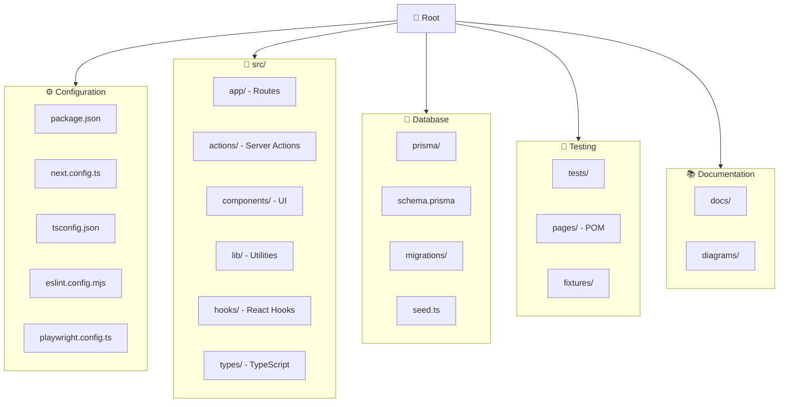
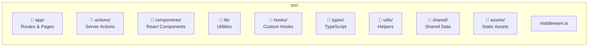
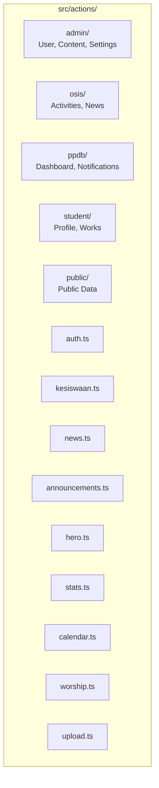
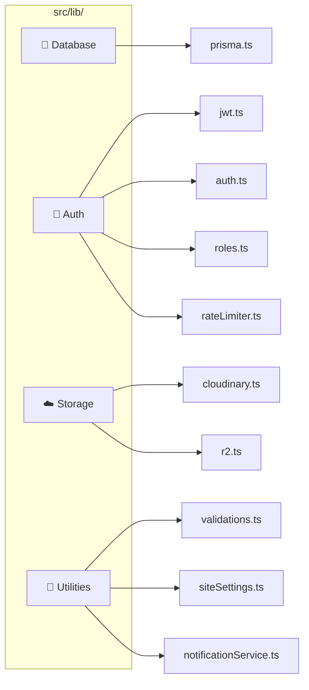
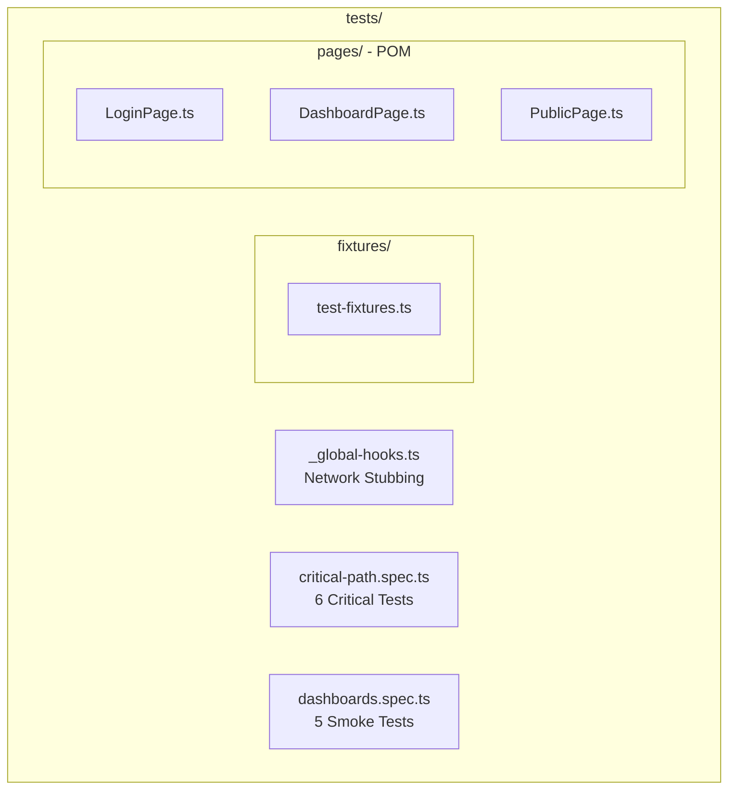

# 📁 Project Directory Structure

## 📑 Table of Contents

1. [Overview](#overview)
2. [Directory Visualization](#directory-visualization)
3. [Root Files](#root-files)
4. [Source Directory](#source-directory-src)
5. [Prisma Directory](#prisma-directory)
6. [Tests Directory](#tests-directory)
7. [Best Practices](#best-practices)

---

## Overview

Proyek ini menggunakan **feature-based architecture** dengan pemisahan yang jelas antara:

- **App Router** untuk routing dan pages
- **Server Actions** untuk data mutations
- **Components** untuk UI reusable
- **Lib** untuk utilities dan business logic

### 🎯 Architecture Principles

| Principle                  | Implementation                     |
| -------------------------- | ---------------------------------- |
| **Feature Colocation**     | Related files grouped by feature   |
| **Separation of Concerns** | Actions, components, lib separated |
| **Type Safety**            | TypeScript strict mode throughout  |
| **Testing Integration**    | Page Object Model pattern          |

---

## Directory Visualization



---

## Root Files

### Configuration Files

| File                     | Purpose                | Key Settings                                 |
| ------------------------ | ---------------------- | -------------------------------------------- |
| `package.json`           | Dependencies & scripts | Next.js 15.5.9, Prisma 6.19, Playwright 1.57 |
| `next.config.ts`         | Next.js configuration  | PWA, security headers, image domains         |
| `tsconfig.json`          | TypeScript config      | Strict mode, path aliases (`@/*`)            |
| `eslint.config.mjs`      | ESLint 9 flat config   | Next.js recommended rules                    |
| `playwright.config.ts`   | E2E test config        | Chromium, base URL, timeouts                 |
| `postcss.config.mjs`     | PostCSS pipeline       | Tailwind CSS v4                              |
| `vercel.json`            | Vercel deployment      | Build settings, redirects                    |
| `lighthouserc.json`      | Lighthouse CI          | Performance thresholds                       |
| `next-sitemap.config.js` | SEO sitemap            | URL priorities, change frequency             |

### Documentation Files

| File                   | Content                       |
| ---------------------- | ----------------------------- |
| `README.md`            | Project overview, setup guide |
| `API_DOCUMENTATION.md` | REST API endpoints            |
| `CONTRIBUTING.md`      | Development guidelines        |
| `CODE_OF_CONDUCT.md`   | Community standards           |
| `LICENSE`              | Proprietary license           |

---

## Source Directory (`src/`)

### 📊 Directory Overview



### `app/` — Next.js App Router

```
src/app/
├── (public)/                 # 🌐 Public pages (no auth required)
│   ├── page.tsx              # Homepage
│   ├── news/                 # News listing & detail
│   │   ├── page.tsx
│   │   └── [slug]/page.tsx
│   ├── announcements/        # Announcements
│   ├── ppdb/                 # PPDB registration
│   │   ├── page.tsx          # Registration form
│   │   ├── status/           # Status check
│   │   └── info/             # Information page
│   ├── karya-siswa/          # Student works gallery
│   ├── facilities/           # School facilities
│   ├── extracurricular/      # Extracurriculars
│   ├── academic-calendar/    # Academic calendar
│   ├── contact/              # Contact form
│   ├── profile/              # School profile
│   └── login/                # Login page
│
├── (dashboard)/              # 🔐 Protected dashboards
│   ├── dashboard-admin/      # Admin dashboard
│   │   ├── page.tsx          # Dashboard home
│   │   ├── users/            # User management
│   │   ├── news/             # News management
│   │   ├── settings/         # Site settings
│   │   └── ...
│   ├── dashboard-kesiswaan/  # Student affairs
│   ├── dashboard-siswa/      # Student portal
│   ├── dashboard-osis/       # OSIS council
│   └── dashboard-ppdb/       # PPDB management
│
├── api/                      # 🔌 REST API endpoints
│   ├── auth/                 # Authentication
│   │   ├── login/route.ts
│   │   ├── logout/route.ts
│   │   └── verify/route.ts
│   ├── ppdb/                 # PPDB operations
│   │   ├── check-nisn/route.ts
│   │   ├── register/route.ts
│   │   ├── status/route.ts
│   │   ├── upload/route.ts
│   │   └── upload-r2/route.ts
│   └── cron/                 # Scheduled tasks
│       ├── cleanup-logs/route.ts
│       └── maintenance-check/route.ts
│
├── maintenance/              # 🔧 Status pages
├── unauthorized/
├── not-found.tsx
├── global-error.tsx
├── layout.tsx                # Root layout
├── globals.css               # Global styles
├── robots.ts                 # Dynamic robots.txt
└── sitemap.ts                # Dynamic sitemap
```

### `actions/` — Server Actions (15+ files)



| Directory/File | Purpose                 | Key Functions                            |
| -------------- | ----------------------- | ---------------------------------------- |
| `admin/`       | Admin dashboard actions | Users CRUD, content management, settings |
| `osis/`        | OSIS dashboard actions  | Activity proposals, news                 |
| `ppdb/`        | PPDB dashboard actions  | Stats, notifications, status updates     |
| `student/`     | Student actions         | Profile, works, achievements             |
| `public/`      | Public page data        | News, facilities, calendar               |
| `auth.ts`      | Authentication helpers  | Session verification                     |
| `kesiswaan.ts` | Student affairs         | Work validation                          |
| `worship.ts`   | Religious programs      | Adzan, carpet schedules                  |

### `components/` — React Components (16 directories)

```
src/components/
├── layout/          # 🏠 Global layouts
│   ├── Navbar.tsx
│   ├── Footer.tsx
│   └── Sidebar.tsx
│
├── common/          # 🔧 Shared utilities
│   ├── Button.tsx
│   ├── Modal.tsx
│   ├── LoadingSpinner.tsx
│   └── ErrorBoundary.tsx
│
├── shared/          # 📦 Reusable components
├── dashboard/       # 📊 Dashboard widgets
├── home/            # 🏡 Homepage sections
├── news/            # 📰 News components
├── announcements/   # 📢 Announcement components
├── facilities/      # 🏫 Facility showcase
├── extracurricular/ # ⚽ Extracurricular display
├── contact/         # 📧 Contact form
├── ppdb/            # 📝 PPDB forms
├── calendar/        # 📅 Calendar views
├── profile/         # 👤 Profile components
├── auth/            # 🔐 Login form + CAPTCHA
├── public/          # 🌐 Public utilities
└── script/          # 📜 Embeds (Flowise)
```

### `lib/` — Backend Utilities (12 files)



| File                     | Purpose                 | Key Exports                       |
| ------------------------ | ----------------------- | --------------------------------- |
| `prisma.ts`              | Prisma client singleton | `prisma`                          |
| `jwt.ts`                 | JWT operations          | `signToken`, `verifyToken`        |
| `auth.ts`                | Auth helpers            | `getCurrentUser`, `requireAuth`   |
| `roles.ts`               | RBAC definitions        | `ROLES`, `hasPermission`          |
| `rateLimiter.ts`         | Rate limiting           | `checkLoginRateLimit`             |
| `cloudinary.ts`          | Cloudinary SDK          | `uploadImage`                     |
| `r2.ts`                  | R2 S3 client            | `uploadToR2`                      |
| `validations.ts`         | Zod schemas             | Form validation schemas           |
| `siteSettings.ts`        | Feature flags           | `getSetting`, `isMaintenanceMode` |
| `notificationService.ts` | Notifications           | `createNotification`              |
| `env.ts`                 | Environment config      | Type-safe env access              |

### `hooks/` — Custom React Hooks (5 files)

| Hook               | Purpose                 | Returns                       |
| ------------------ | ----------------------- | ----------------------------- |
| `useAuth`          | Authentication state    | `user`, `isLoading`, `logout` |
| `useAntiBot`       | CAPTCHA + honeypot      | `captcha`, `validateAntiBot`  |
| `useSidebar`       | Dashboard sidebar state | `isOpen`, `toggle`            |
| `useToastConfirm`  | Confirmation dialogs    | `confirm`, `isConfirming`     |
| `useNotifications` | Real-time notifications | `notifications`, `markRead`   |

### Other Directories

| Directory | Content                                        |
| --------- | ---------------------------------------------- |
| `types/`  | Type-only helpers for actions/components       |
| `utils/`  | General helpers (formatting, guards, security) |
| `shared/` | Shared types and data across modules           |
| `assets/` | Static asset references (Lottie paths)         |

---

## Prisma Directory

```
prisma/
├── schema.prisma              # 📋 Database schema (25+ models, 14 enums)
├── seed.ts                    # 🌱 Base users & settings seeder
├── seedContent.ts             # 📰 Content seeder (news, announcements)
├── seedNotifications.ts       # 🔔 Notification test data
├── importStudentsFromExcel.ts # 📊 Excel import utility
├── migrations/                # 📦 Migration history
│   ├── migration_lock.toml
│   └── 20251228142724_init/
└── data/                      # 📁 Seed data files
    ├── credentials-siswa.csv
    └── credentials-siswa.txt
```

### Database Scripts

```bash
# Generate Prisma Client
npm run db:generate

# Create and apply migrations
npm run db:migrate

# Seed base data
npm run db:seed

# Seed content data
npm run db:seed-content

# Seed all data
npm run db:seed-all

# Reset database (destructive!)
npm run db:reset

# Migrate static JSON to database
npm run db:migrate-static
```

---

## Tests Directory



### Test Files

| File                    | Tests  | Purpose                                  |
| ----------------------- | ------ | ---------------------------------------- |
| `critical-path.spec.ts` | 6      | Homepage, public pages, admin CRUD, RBAC |
| `dashboards.spec.ts`    | 5      | Smoke tests for all 5 role dashboards    |
| **Total**               | **11** | Focused, deterministic, ~2 min runtime   |

### Page Object Model

```typescript
// Example: LoginPage.ts
export class LoginPage {
  constructor(private page: Page) {}

  async login(username: string, password: string, role: string) {
    await this.page.goto("/login");
    await this.page.fill('[name="username"]', username);
    await this.page.fill('[name="password"]', password);
    // CAPTCHA handling...
    await this.page.click('button[type="submit"]');
  }

  async expectDashboardRedirect(role: string) {
    await this.page.waitForURL(`/dashboard-${role}`);
  }
}
```

---

## Best Practices

### 📁 File Organization

| Practice                   | Example                                            |
| -------------------------- | -------------------------------------------------- |
| **Colocate related files** | `news/page.tsx`, `news/NewsCard.tsx`               |
| **Use index exports**      | `components/index.ts` for barrel exports           |
| **Separate concerns**      | Actions in `actions/`, components in `components/` |
| **Type-safe imports**      | Use `@/` path alias                                |

### 🔒 Security Practices

| Practice           | Implementation               |
| ------------------ | ---------------------------- |
| **Server Actions** | Validate with Zod on server  |
| **API Routes**     | Check auth in each handler   |
| **Rate Limiting**  | Apply to sensitive endpoints |
| **Sensitive Data** | Use environment variables    |

### 🧪 Testing Practices

| Practice              | Implementation                      |
| --------------------- | ----------------------------------- |
| **Page Object Model** | Encapsulate page interactions       |
| **Network Stubbing**  | Mock external services              |
| **Database Cleanup**  | Clean test data in `afterEach`      |
| **Focused Tests**     | Test critical paths, not everything |

### 📝 Naming Conventions

| Type                 | Convention     | Example                   |
| -------------------- | -------------- | ------------------------- |
| **Files**            | kebab-case     | `user-management.tsx`     |
| **Components**       | PascalCase     | `UserCard.tsx`            |
| **Functions**        | camelCase      | `getUserById()`           |
| **Constants**        | SCREAMING_CASE | `MAX_LOGIN_ATTEMPTS`      |
| **Types/Interfaces** | PascalCase     | `UserRole`, `AuthPayload` |

---

## 📚 Related Documentation

| Document                              | Description            |
| ------------------------------------- | ---------------------- |
| [ARCHITECTURE.md](./ARCHITECTURE.md)  | System architecture    |
| [TECH_STACK.md](./TECH_STACK.md)      | Technology details     |
| [TESTING.md](./TESTING.md)            | Testing guide          |
| [CONTRIBUTING.md](../CONTRIBUTING.md) | Development guidelines |

---

_Last Updated: January 2026_
