# 🛠️ Technology Stack

## 📑 Table of Contents

1. [Overview](#overview)
2. [Technology Diagram](#technology-diagram)
3. [Core Framework](#core-framework)
4. [Styling & UI](#styling--ui)
5. [Data & State Management](#data--state-management)
6. [Authentication & Security](#authentication--security)
7. [Cloud Services](#cloud-services)
8. [Development Tools](#development-tools)
9. [Database Models](#database-models)
10. [Package Dependencies](#package-dependencies)

---

## Overview

SMP IP Yakin dibangun dengan stack teknologi modern yang dipilih berdasarkan:

| Kriteria        | Pilihan               | Alasan                             |
| --------------- | --------------------- | ---------------------------------- |
| **Performance** | Next.js 15 + React 18 | Server Components, streaming SSR   |
| **Type Safety** | TypeScript 5.9        | Compile-time error detection       |
| **Styling**     | Tailwind CSS v4       | Utility-first, design system ready |
| **Database**    | PostgreSQL + Prisma   | Type-safe queries, migrations      |
| **Security**    | Jose + bcryptjs       | Industry-standard JWT & hashing    |

---

## Technology Diagram


---

## Core Framework

### Next.js 15.5.9 (App Router)


| Feature               | Usage                     | Benefit                     |
| --------------------- | ------------------------- | --------------------------- |
| **Server Components** | Default rendering mode    | Reduced bundle, faster load |
| **Server Actions**    | Form handling, CRUD       | No API boilerplate          |
| **Middleware**        | Auth check, redirects     | Edge-level security         |
| **Layouts**           | Shared UI, nested routes  | Code reuse                  |
| **Route Groups**      | `(public)`, `(dashboard)` | Organized routing           |

### TypeScript 5.9.3

| Configuration | Value             | Purpose             |
| ------------- | ----------------- | ------------------- |
| `strict`      | `true`            | Maximum type safety |
| `noEmit`      | CI check          | Type verification   |
| `paths`       | `@/*` → `./src/*` | Clean imports       |

### React 18.3.1

| Feature             | Usage               |
| ------------------- | ------------------- |
| Concurrent Features | Streaming, Suspense |
| Server Components   | Data fetching       |
| Client Components   | Interactive UI      |

---

## Styling & UI

### Tailwind CSS v4.1.11


| Aspect        | Implementation                      |
| ------------- | ----------------------------------- |
| **Pipeline**  | PostCSS with `@tailwindcss/postcss` |
| **Dark Mode** | `next-themes` integration           |
| **Utilities** | `clsx` + `tailwind-merge`           |

### Animation Libraries

| Library             | Version | Usage                                |
| ------------------- | ------- | ------------------------------------ |
| **Framer Motion**   | 12.23.x | Page transitions, micro-interactions |
| **DotLottie React** | 0.17.x  | Loading animations, illustrations    |

### Icon Systems

| Library          | Icons | Style                   |
| ---------------- | ----- | ----------------------- |
| **Lucide React** | 1000+ | Modern, consistent      |
| **Heroicons**    | 450+  | Official Tailwind icons |

### Chart & Visualization

| Library      | Version | Usage                       |
| ------------ | ------- | --------------------------- |
| **Recharts** | 3.6.x   | Dashboard charts, analytics |

---

## Data & State Management

### Prisma 6.19 (ORM)

```mermaid
graph LR
    Schema[schema.prisma] --> Generate[prisma generate]
    Generate --> Client[@prisma/client]
    Client --> TypeSafe[Type-safe Queries]

    subgraph Operations["CRUD Operations"]
        Create[create/createMany]
        Read[findUnique/findMany]
        Update[update/updateMany]
        Delete[delete/deleteMany]
    end

    TypeSafe --> Operations
```

| Feature             | Benefit                            |
| ------------------- | ---------------------------------- |
| **Type Generation** | Auto-complete, compile-time checks |
| **Migrations**      | Version-controlled schema changes  |
| **Relations**       | Intuitive relationship handling    |
| **Transactions**    | ACID compliance                    |

### PostgreSQL 15+

| Aspect           | Configuration                     |
| ---------------- | --------------------------------- |
| **Primary Keys** | UUID (`@default(uuid())`)         |
| **Indexes**      | Composite indexes for performance |
| **Enums**        | 14 custom enum types              |
| **SSL**          | `sslmode=require` (production)    |

### Zod 4.x (Validation)

```typescript
// Example: PPDB Form Validation
const ppdbSchema = z.object({
  namaLengkap: z.string().min(3).max(100),
  nisn: z.string().length(10).regex(/^\d+$/),
  jenisKelamin: z.enum(["laki-laki", "perempuan"]),
  tanggalLahir: z.string().refine(isValidDate),
  kontakOrtu: z.string().regex(/^08\d{9,12}$/),
});
```

| Usage               | Location                 |
| ------------------- | ------------------------ |
| **Form Validation** | Client + Server Actions  |
| **API Validation**  | API Route handlers       |
| **Type Inference**  | `z.infer<typeof schema>` |

---

## Authentication & Security

### Jose 6.x (JWT)


| Configuration | Value        | Purpose           |
| ------------- | ------------ | ----------------- |
| Algorithm     | `HS256`      | Symmetric signing |
| Expiration    | `24h`        | Session duration  |
| Cookie        | `auth-token` | HTTP-Only storage |
| IP Binding    | In payload   | Session security  |

### bcryptjs 3.x

| Parameter       | Value    | Security Level   |
| --------------- | -------- | ---------------- |
| **Salt Rounds** | 12       | ~300ms hash time |
| **Hash Length** | 60 chars | Standard bcrypt  |

### Rate Limiting

| Type                | Storage    | Limits                 |
| ------------------- | ---------- | ---------------------- |
| **Login (IP)**      | PostgreSQL | 5 attempts / 15 min    |
| **Login (Account)** | PostgreSQL | 10 attempts / 24 hours |
| **PPDB Register**   | In-memory  | 5 / hour / IP          |
| **PPDB Upload**     | In-memory  | 20 / hour / IP         |

---

## Cloud Services

### Storage Architecture


| Service         | Provider      | Usage                | SDK                   |
| --------------- | ------------- | -------------------- | --------------------- |
| **CDN Images**  | Cloudinary    | News, hero, profiles | `next-cloudinary`     |
| **PPDB Images** | Cloudinary    | Dedicated preset     | `cloudinary`          |
| **Documents**   | Cloudflare R2 | PPDB documents       | `@aws-sdk/client-s3`  |
| **Email**       | EmailJS       | Contact form         | `@emailjs/browser`    |
| **Chatbot**     | Flowise       | AI assistant         | `flowise-embed-react` |

### Vercel Hosting

| Feature            | Usage                    |
| ------------------ | ------------------------ |
| **Edge Functions** | Middleware, API routes   |
| **Serverless**     | Server Actions, SSR      |
| **CDN**            | Static assets, ISR       |
| **Analytics**      | `@vercel/analytics`      |
| **Speed Insights** | `@vercel/speed-insights` |

---

## Development Tools

### Testing Stack

```mermaid
graph LR
    subgraph Testing["🧪 Testing"]
        Playwright[Playwright 1.57]
        POM[Page Object Model]
        Fixtures[Test Fixtures]
    end

    subgraph Coverage["Coverage"]
        Critical[Critical Path Tests]
        Smoke[Smoke Tests]
        DB[Database Verification]
    end

    Playwright --> POM
    POM --> Fixtures
    Fixtures --> Coverage
```



| Tool           | Version | Purpose                    |
| -------------- | ------- | -------------------------- |
| **Playwright** | 1.57.x  | E2E browser testing        |
| **ESLint**     | 9.x     | Code linting (flat config) |
| **TypeScript** | 5.9.x   | Type checking              |
| **tsx**        | 4.20.x  | TS script runner           |

### Build & CI

| Tool                | Purpose                |
| ------------------- | ---------------------- |
| **npm ci**          | Reproducible installs  |
| **next build**      | Production build       |
| **next-sitemap**    | SEO sitemap generation |
| **prisma generate** | Client generation      |

---

## Database Models

### Model Categories (25+ Models)

```mermaid
graph TB
    subgraph Auth["🔐 Auth & Users (3)"]
        User[User]
        Siswa[Siswa]
        Kesiswaan[Kesiswaan]
    end

    subgraph Content["📰 Content (6)"]
        News[News]
        Announcement[Announcement]
        HeroSlide[HeroSlide]
        SchoolStat[SchoolStat]
        SchoolActivity[SchoolActivity]
        OsisActivity[OsisActivity]
    end

    subgraph Student["🎓 Student Output (3)"]
        Achievement[StudentAchievement]
        Work[StudentWork]
        Notification[Notification]
    end

    subgraph Academic["🏫 Academic (3)"]
        Facility[Facility]
        Extracurricular[Extracurricular]
        Teacher[Teacher]
    end

    subgraph Security["🔒 Security (3)"]
        LoginAttempt[LoginAttempt]
        SiteSettings[SiteSettings]
        MaintenanceSchedule[MaintenanceSchedule]
    end

    subgraph Worship["🕌 Religious (4)"]
        Menstruation[WorshipMenstruationRecord]
        Adzan[WorshipAdzanSchedule]
        CarpetSchedule[WorshipCarpetSchedule]
        CarpetAssignment[WorshipCarpetAssignment]
    end

    subgraph PPDB["📝 PPDB (1)"]
        PPDBApp[PPDBApplication]
    end
```



### Enum Types (14)

| Category     | Enums                                             |
| ------------ | ------------------------------------------------- |
| **User**     | `UserRole`                                        |
| **General**  | `GenderType`, `SettingType`                       |
| **Status**   | `PPDBStatus`, `StatusApproval`, `TaskStatus`      |
| **Content**  | `PriorityLevel`, `BeritaKategori`, `SemesterType` |
| **Student**  | `WorkType`, `NotificationType`                    |
| **Academic** | `TeacherCategory`                                 |
| **Worship**  | `PrayerTime`, `CarpetZone`                        |

---

## Package Dependencies

### Production Dependencies

| Package               | Version   | Category         |
| --------------------- | --------- | ---------------- |
| `next`                | ^15.5.9   | Framework        |
| `react` / `react-dom` | ^18.3.1   | UI Library       |
| `@prisma/client`      | ^6.19.1   | Database ORM     |
| `zod`                 | ^4.1.13   | Validation       |
| `jose`                | ^6.0.12   | JWT              |
| `bcryptjs`            | ^3.0.2    | Password Hashing |
| `tailwindcss`         | ^4.1.11   | Styling          |
| `framer-motion`       | ^12.23.25 | Animation        |
| `cloudinary`          | ^2.7.0    | Image CDN        |
| `@aws-sdk/client-s3`  | ^3.956.0  | R2 Storage       |

### Development Dependencies

| Package            | Version | Purpose          |
| ------------------ | ------- | ---------------- |
| `typescript`       | ^5.9.3  | Type System      |
| `@playwright/test` | ^1.57.0 | E2E Testing      |
| `eslint`           | ^9      | Linting          |
| `prisma`           | ^6.19.1 | CLI & Migrations |
| `tsx`              | ^4.20.3 | Script Runner    |

---

## 📚 Related Documentation

| Document                                       | Description                 |
| ---------------------------------------------- | --------------------------- |
| [ARCHITECTURE.md](./ARCHITECTURE.md)           | System architecture details |
| [PROJECT_STRUCTURE.md](./PROJECT_STRUCTURE.md) | Directory organization      |
| [SECURITY.md](./SECURITY.md)                   | Security implementations    |
| [package.json](../package.json)                | Full dependency list        |

---

_Last Updated: January 2026_
