# 🧪 Testing Documentation

## SMP IP Yakin — E2E Testing Guide

Dokumentasi lengkap untuk automated testing menggunakan **Playwright**.

---

## 📑 Table of Contents

1. [Overview](#overview)
2. [Test Architecture Diagram](#test-architecture-diagram)
3. [Test Structure](#test-structure)
4. [Setup & Installation](#setup--installation)
5. [Running Tests](#running-tests)
6. [Test Files Explained](#test-files-explained)
7. [Page Object Model](#page-object-model)
8. [Best Practices](#best-practices)
9. [Troubleshooting](#troubleshooting)
10. [CI/CD Integration](#cicd-integration)

---

## Overview

### Testing Philosophy

```mermaid
graph TB
    subgraph Pyramid["🔺 Testing Pyramid"]
        E2E["E2E Tests (~50 tests)<br/>Critical user flows"]
        Smoke["Smoke Tests<br/>Dashboard accessibility"]
        Unit["Unit Tests<br/>(Future: Component tests)"]
    end

    subgraph Focus["Focus Areas"]
        Critical["✅ Critical Paths"]
        DB["✅ Database Integration"]
        RBAC["✅ RBAC Security"]
        Speed["✅ Fast Execution"]
    end

    E2E --> Critical
    E2E --> DB
    E2E --> RBAC
    Smoke --> Speed
```



### Testing Stack

| Technology     | Version | Purpose                            |
| -------------- | ------- | ---------------------------------- |
| **Playwright** | ^1.57.0 | E2E testing framework by Microsoft |
| **TypeScript** | 5.9.3   | Type safety for test scripts       |
| **Prisma**     | 6.19    | Direct database verification       |
| **Node.js**    | 20.x    | Runtime environment                |

### Why This Approach?

| Benefit                  | Implementation                               |
| ------------------------ | -------------------------------------------- |
| ✅ **Fast & Focused**    | Core tests run in ~3 minutes                 |
| ✅ **Reliable**          | Explicit waits, no flaky `waitForTimeout`    |
| ✅ **Maintainable**      | Page Object Model pattern                    |
| ✅ **CI-Ready**          | Optimized for GitHub Actions                 |
| ✅ **Database Verified** | Tests confirm data persistence               |

---

## Test Architecture Diagram


---

## Test Structure

```
tests/
├── api.spec.ts                # 🔌 API Endpoint Tests
├── auth.spec.ts               # 🔐 Authentication Flow Tests
├── critical-path.spec.ts      # 🎯 Critical User Journeys
├── dashboards.spec.ts         # 🚀 Dashboard Smoke Tests
├── forms.spec.ts              # 📝 Form Validation Tests
├── navigation.spec.ts         # 🧭 Navigation & Accessibility
├── _global-hooks.ts           # 🔧 Setup & Teardown
├── fixtures/
│   └── test-fixtures.ts       # 📦 Test Utilities & Users
└── pages/
    └── LoginPage.ts           # 🔐 Login Page Object
```

### Test Count Summary

| File                    | Tests | Description                        |
| ----------------------- | ----- | ---------------------------------- |
| `api.spec.ts`           | ~10   | Validates API endpoints & security |
| `auth.spec.ts`          | ~8    | Detailed auth flows & RBAC         |
| `critical-path.spec.ts` | 6     | End-to-end critical scenarios      |
| `dashboards.spec.ts`    | 5     | Smoke tests for all dashboards     |
| `forms.spec.ts`         | 12    | Form inputs & validations          |
| `navigation.spec.ts`    | 18    | Public navigation & accessibility  |

---

## Setup & Installation

### Prerequisites

```bash
# Required
- Node.js >= 20
- npm (use npm ci for lockfile parity)
```

### Installation

```bash
# 1. Install all dependencies
npm ci

# 2. Install Playwright browser
npx playwright install --with-deps chromium

# 3. Setup database (Local SQLite)
# Create .env with DATABASE_URL="file:./dev.db"
# Ensure prisma/schema.prisma has provider = "sqlite" (dev only)
npx prisma db push
npm run db:seed
```

---

## Running Tests

### NPM Scripts

| Command                 | Description                           |
| ----------------------- | ------------------------------------- |
| `npm run test`          | Run ALL tests                         |
| `npm run test:critical` | Run critical path only (6 tests) — CI |
| `npm run test:api`      | Run API tests                         |
| `npm run test:auth`     | Run Authentication tests              |
| `npm run test:forms`    | Run Form tests                        |
| `npm run test:nav`      | Run Navigation tests                  |
| `npm run test:ui`       | Interactive Playwright UI             |
| `npm run test:report`   | Open HTML report                      |

### Quick Commands

```bash
# Run specific test file
npx playwright test tests/dashboards.spec.ts

# Run with headed browser (visible)
npx playwright test --headed

# Debug mode
npx playwright test --debug
```

---

## Best Practices

### ✅ DO

```typescript
// 1. Use explicit waits
await element.waitFor({ state: "visible", timeout: 15000 });

// 2. Use Page Objects
const loginPage = new LoginPage(page);
await loginPage.loginAs("admin");

// 3. Use first() for multiple elements
await page.locator("h1").first().toBeVisible();

// 4. Set appropriate timeouts for login flows
test.setTimeout(120000);
```

### ❌ DON'T

```typescript
// 1. Don't use arbitrary timeouts
await page.waitForTimeout(5000); // ❌ Flaky

// 2. Don't hardcode selectors inline
await page.click("#btn-xyz"); // ❌ Put in Page Object
```

---

## Troubleshooting

### Common Issues

#### 1. "Timeout waiting for element"

```bash
# Solution: Increase timeout or use explicit wait
await element.waitFor({ state: "visible", timeout: 20000 });
```

#### 2. "Strict mode violation"

```bash
# Solution: Use .first() or more specific selector
await page.locator("h1").first().toBeVisible();
```

#### 3. "Login failed"

```bash
# Check if database is seeded correctly: npm run db:seed
# Ensure user credentials in fixtures/test-fixtures.ts match database
```

#### 4. "Database provider error"

```bash
# If switching between SQLite (Local) and Postgres (Prod),
# ensure prisma/schema.prisma provider matches your .env DATABASE_URL protocol.
```

---

## CI/CD Integration

### GitHub Actions Workflow

See `.github/workflows/ci.yml` for full configuration.
Tests run against a PostgreSQL service container to match production environment closer than SQLite.

---

_Last Updated: January 2026_
