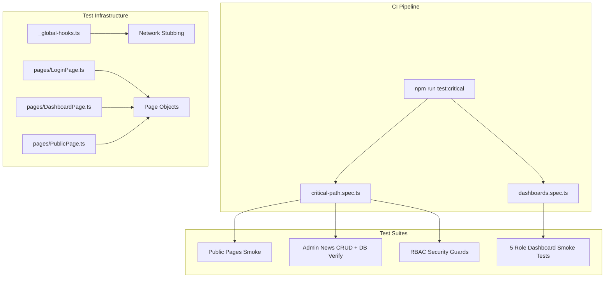

# Test Strategy Overview

Goal: keep E2E tests fast, deterministic, and focused on the highest-value flows.

## Test Architecture



## Current Scope

| Spec File               | Tests | Coverage                                                                           |
| ----------------------- | ----- | ---------------------------------------------------------------------------------- |
| `critical-path.spec.ts` | 6     | Homepage, 8 public pages, admin login, news CRUD with DB verification, RBAC guards |
| `dashboards.spec.ts`    | 5     | Smoke tests for Admin, Siswa, Kesiswaan, OSIS, PPDB dashboards                     |

**Total: 11 tests** — Runs in ~2 minutes on Chromium

## Test Categories

### Critical Path Tests (`critical-path.spec.ts`)

1. **Homepage Smoke** — Verifies title and basic accessibility
2. **Public Pages Navigation** — Tests 8 public routes are accessible
3. **Admin Login** — Validates login flow and dashboard access
4. **Admin News CRUD** — Creates/deletes news with direct Prisma DB verification
5. **Student Access Restriction** — Verifies RBAC prevents unauthorized access
6. **Unauthorized Redirect** — Tests redirect to unauthorized page

### Dashboard Smoke Tests (`dashboards.spec.ts`)

- Parameterized tests for all 5 roles
- Verifies login and dashboard accessibility
- Fast execution with minimal assertions

## Network Stubbing

`tests/_global-hooks.ts` intercepts external requests for deterministic tests:

| Service          | Strategy                   |
| ---------------- | -------------------------- |
| Cloudinary       | Return 1x1 transparent SVG |
| Unsplash         | Return 1x1 transparent SVG |
| UI-Avatars       | Return 1x1 transparent SVG |
| Google Analytics | Abort request              |
| Vercel Analytics | Abort request              |

## Local Commands

```bash
# Run CI-equivalent suite (recommended)
npm run test:critical

# Run all specs
npm run test

# Interactive debugging
npm run test:ui

# View HTML report
npm run test:report
```

## CI Expectations

1. Database reset before tests: `npm run db:reset`
2. Chromium only: `npx playwright install --with-deps chromium`
3. Environment variables set for database connection
4. Failures upload Playwright HTML report as artifact

## Best Practices

### Do's

- ✅ Use Page Object Model for all interactions
- ✅ Clean up test data in `afterEach` hooks
- ✅ Use `waitFor({ state: "attached" })` before visibility checks (Framer Motion compatibility)
- ✅ Verify critical operations with direct database queries
- ✅ Keep tests independent — no shared state between specs

### Don'ts

- ❌ Avoid `waitForTimeout()` — use explicit waits instead
- ❌ Don't rely on storage state for complex flows
- ❌ Don't add tests without cleanup logic
- ❌ Don't use hardcoded waits for animations

## Adding New Tests

1. **Keep it focused** — One assertion per concept
2. **Use Page Objects** — Add methods to `tests/pages/*.ts`
3. **Clean up data** — Delete any created records in `afterEach`
4. **Stub external calls** — Add patterns to `_global-hooks.ts` if needed
5. **Tag heavy specs** — Use `@nightly` tag for slow/comprehensive tests

## Troubleshooting

| Issue                       | Solution                                                     |
| --------------------------- | ------------------------------------------------------------ |
| Element "hidden" but exists | Add `waitFor({ state: "attached" })` before visibility check |
| Timeout on navigation       | Increase timeout, add `waitUntil: "domcontentloaded"`        |
| Flaky login                 | Ensure animation completes before interacting                |
| DB verification fails       | Check if `afterEach` cleanup ran properly                    |
